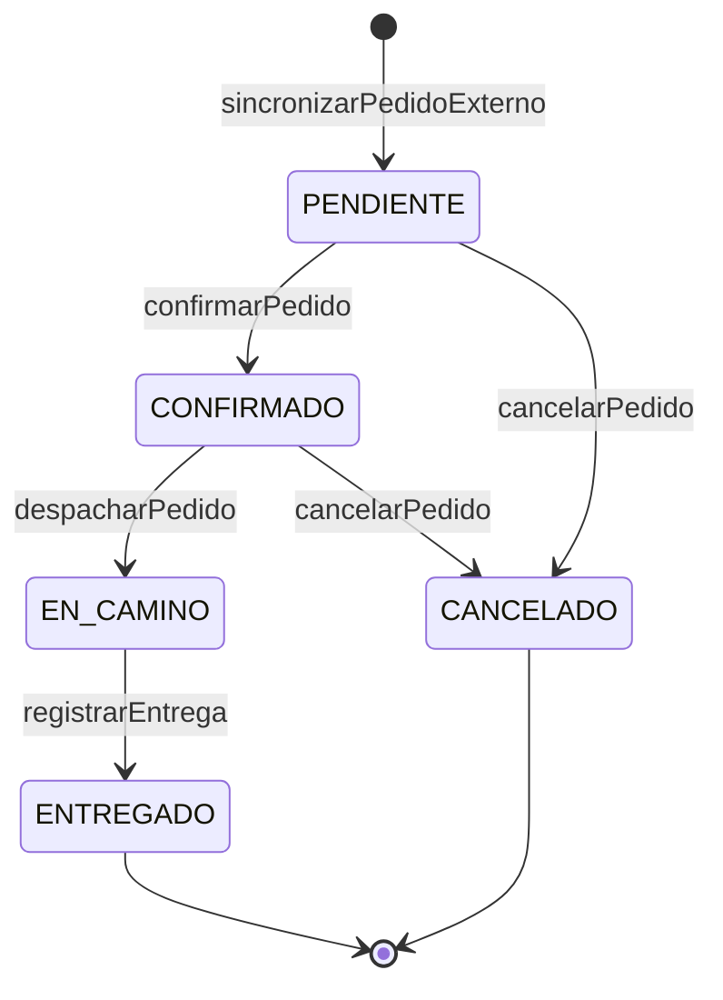

# Arquitectura

## Capas

Cada componente se organiza en tres capas con dependencia en un solo
sentido: **Presentación → Negocio → Datos**.

| Capa | Tecnología | Responsabilidad | Paquete |
|---|---|---|---|
| Presentación | JSF (`@Named` + `@ViewScoped`), Facelets | Mostrar y capturar datos. Sin reglas de negocio. | `presentacion/` |
| Negocio | EJB (`@Stateless`, `@Stateful`, `@Singleton`, `@MessageDriven`) | Reglas del dominio, transacciones, seguridad, orquestación entre componentes | `negocio/` |
| Datos | JPA / Hibernate | Persistencia. Única capa que toca el `EntityManager` | `datos/`, `datos/model/` |
| (transversal) | POJOs | Objetos que cruzan capas y componentes | `dto/` |

**Por qué así:** la vista nunca ve entidades JPA (evita
`LazyInitializationException` y acopla la vista al esquema), y las reglas
viven en un solo lugar (el EJB), sin importar si las invoca una pantalla,
un timer o un MDB.

## Componentes

Cada componente expone interfaces `@Local` separadas por uso (lectura vs.
escritura) y nunca expone sus entidades ni sus excepciones internas a
otro componente. Las referencias entre componentes se guardan como IDs
(`Long idComercio`), no como relaciones JPA.

| Componente | Estado | Interfaces | Tipo de EJB | Por qué ese tipo |
|---|---|---|---|---|
| Comercios | Implementado | `IRegistroComercios`, `IConsultaComercios` | `@Stateless` | Cada operación recibe todo lo que necesita; el estado vive en la base |
| Inventario | Implementado | `IConsultaStock`, `IReservaStock` | `@Stateful` (un solo EJB, `InventarioService`, implementa las dos) | La reserva es una conversación: `reservarStock` y `confirmarReserva` operan sobre la misma instancia |
| Pedidos | Implementado | `IGestionPedidos`, `ISeguimientoPedido` | `@Stateless` (Facade) | El estado del pedido vive en la base; ninguna operación depende de una llamada anterior |
| Seguridad | Implementado | `IRegistroUsuarios`, `IConsultaUsuarios`, `IContextoUsuario` | `@Stateless` | Idem Comercios |
| Integración banco legado | Implementado | `IBancoClient` | `@Stateless` + `@Singleton` (`CircuitBreakerBanco`) | Cliente SOAP sin estado de conversación; el estado del circuit breaker es uno solo, compartido por todas las llamadas |
| Pagos y Cobranzas | Implementado | `IRegistroCobros`, `IConsultaCobros` | `@Stateless` + `@MessageDriven` (suscriptor) | El cobro queda registrado en la base; se suma a la transacción del llamador |
| Repartidores | Implementado | `IAsignacionRepartidores`, `IGestionRepartidores` | `@Stateless` | La disponibilidad del repartidor es un dato persistido, no de sesión |
| Notificaciones | Implementado | `INotificaciones` | `@Stateless` + `@MessageDriven` (suscriptor) | Reacciona a eventos del tópico; nadie la llama para avisar |
| Ruteo | Implementado | `IRuteo`, `IZonas` | `@Stateless` | Arma cada hoja de ruta de cero con lo que está en la base; las zonas son datos persistidos y el despacho no depende de una llamada anterior |
| Transportistas | Implementado | `IGestionTransportistas`, `IEnvios`, `ISeguimientoEnvios` | `@Stateless` + `@Singleton` (`SeguimientoDeEnvios`, timer) | El estado de cada envío vive en la base; el seguimiento es una sola tarea periódica |

### Operaciones por componente (implementado)

| Componente | Interfaz | Operaciones | Quién la usa |
|---|---|---|---|
| Comercios | `IRegistroComercios` | `registrarComercio`, `actualizarDatosFiscales`, `darDeBajaComercio`, `reactivarComercio`, `eliminarComercio`, `registrarPuntoPicking`, `darDeBajaPuntoPicking`, `reactivarPuntoPicking` | `ComercioBean`, `PuntoPickingBean` |
| Comercios | `IConsultaComercios` | `obtenerComercio`, `listarTodos`, `listarPuntosPicking`, `listarPuntosPickingDeComercio`, `validarComercioActivo` | Vistas, Inventario, Pedidos, Ruteo, Seguridad (`UsuarioService`, `SesionBean`) |
| Inventario | `IConsultaStock` | `registrarDeposito`, `listarDepositos`, `obtenerDeposito`, `listarDepositosConStock`, `registrarItem`, `listarItemsPorDeposito` / `PorComercio` / `PorComercioYDeposito`, `listarStockDelComercioActual`, `consultarDisponibilidad`, `listarHistorialReservas` | `DepositoBean`, `ItemInventarioBean`, `HistorialReservasBean`, `PedidoBean`, `PortalComercioBean`, Ruteo |
| Inventario | `IReservaStock` | `reservarStock`, `confirmarReserva`, `liberarReserva`, `extenderReserva`, `obtenerReservaActual`, `hayReservaVigente`, `registrarDevolucion` | `ReservaBean`, Pedidos |
| Pedidos | `IGestionPedidos` | `registrarPedidoExterno`, `sincronizarPedidoExterno`, `descartarPedidoExterno`, `confirmarPedido`, `confirmarPedidoEnZona`, `derivarATransportista`, `despacharPedido`, `registrarEntrega`, `cancelarPedido` | `PedidoBean`, `MisEntregasBean`, Ruteo, MDB, timer |
| Pedidos | `ISeguimientoPedido` | `listarPedidosExternos`, `consultarPedidoExterno`, `consultarEstadoPedido`, `listarTodos`, `listarPedidosDeComercio`, `listarEntregasEnCurso`, `listarPedidosDelComercioActual`, `listarPedidosDelRepartidorActual` | `PedidoBean`, `PortalComercioBean`, Ruteo, API REST |
| Seguridad | `IRegistroUsuarios` | `registrarUsuario`, `darDeBaja` | `UsuarioBean` |
| Seguridad | `IConsultaUsuarios` | `listarTodos`, `obtenerUsuario` | `UsuarioBean` |
| Seguridad | `IContextoUsuario` | `idComercioActual`, `idRepartidorActual` | Pedidos, Inventario, Comercios, Notificaciones, `SesionBean` |
| Transportistas | `IGestionTransportistas` | `registrarTransportista`, `darDeBajaTransportista`, `reactivarTransportista`, `listarTodos`, `listarActivos` | `TransportistaBean`, `PedidoBean`, `SeguimientoDeEnvios` |
| Transportistas | `IEnvios` | `solicitarEnvio`, `cancelarEnvioDePedido`, `listarEnvios`, `listarEnviosDelComercioActual` | Pedidos, Ruteo, `PedidoBean`, `TransportistaBean`, `PortalComercioBean` |
| Transportistas | `ISeguimientoEnvios` | `listarEnviosActivos`, `registrarNovedad` | `SeguimientoDeEnvios` (interna del componente) |
| Ruteo | `IRuteo` | `listarEntregasEnCurso`, `entregaActualDelRepartidor`, `historialDelRepartidor`, `listarPendientesPorZona`, `despacharPedido`, `despacharZona` | `EntregasBean`, `MisEntregasBean`, `RuteoBean` |
| Ruteo | `IZonas` | `registrarZona`, `darDeBajaZona`, `reactivarZona`, `listarTodas`, `zonaDeCodigoPostal` | `RuteoBean`, `RepartidorBean`, `RuteoService` |
| Pagos | `IRegistroCobros` | `registrarCobro`, `registrarCobroContraEntrega`, `anularCobro` (`ADMINISTRADOR`) | Pedidos, `SuscriptorPagosEstadoPedido` |
| Pagos | `IConsultaCobros` | `obtenerCobroDePedido`, `listarTodos`, `listarCobrosDelComercioActual` | `PedidoBean`, `PortalComercioBean` |
| Repartidores | `IAsignacionRepartidores` | `asignarRepartidor` (con zona preferida), `liberarRepartidor` | Pedidos |
| Repartidores | `IGestionRepartidores` | `registrarRepartidor`, `asignarZona`, `listarTodos`, `obtenerRepartidor` | `RepartidorBean`, `PedidoBean`, Ruteo, Seguridad |
| Notificaciones | `INotificaciones` | `avisarCambioDeEstado`, `listarRecientes`, `listarDelComercioActual` | `SuscriptorNotificacionesEstadoPedido`, `PedidoBean`, `PortalComercioBean` |

Otros detalles de cada componente:

- **Inventario:** `IReservaStock` mantiene la reserva abierta entre
  requests con `@StatefulTimeout`; `BarredorDeReservas` (`@Schedule`)
  libera las reservas vencidas que el usuario no resolvió.
- **Comercios:** eliminar un comercio es físico y solo se permite si ya
  está dado de baja y si nada lo referencia (pedidos, pedidos del ERP,
  stock consignado, cuentas de usuario): cada componente lo verifica al
  recibir el evento `EliminacionDeComercio`. Si hay referencias, el
  comercio queda dado de baja.
- **Pedidos:** un pedido es multi-línea (`LineaPedido`). Con origen
  `STOCK_CONSIGNADO` cada línea reserva y confirma stock en su propia
  instancia de `IReservaStock`; con `PUNTO_PICKING` solo se valida que el
  punto de picking esté activo. Al cancelar, solo se devuelve el stock de
  las líneas con `idReservaStock`.
- **Seguridad:** `LoginBean` y `SesionBean` toman el usuario y sus roles
  del `SecurityContext` de WildFly. `SesionBean` además usa
  `IContextoUsuario` para saber a qué comercio o repartidor representa la
  cuenta (lo muestra en el menú). `IContextoUsuario` es la pieza que usan
  los demás componentes para filtrar por dueño.
- **Pagos:** PREPAGO se cobra por SOAP en el banco legado al confirmar
  (rechaza por encima de $500.000); si la confirmación falla después, se
  pide la reversa al banco;
  CONTRA_ENTREGA queda PENDIENTE y se acredita al recibir `ENTREGADO` por
  el tópico.
- **Repartidores:** `asignarRepartidor` toma el primero DISPONIBLE con
  bloqueo pesimista, para que dos confirmaciones simultáneas no se lleven
  al mismo repartidor. Se libera al entregar o cancelar el pedido.
- **Notificaciones:** el aviso es simulado (queda guardado y se ve en
  `pedidos.xhtml` y en el portal del comercio). Descarta eventos más
  viejos que el último avisado del mismo pedido.
- **Transportistas:** un pedido pendiente se puede **derivar** a una
  empresa de envíos externa en lugar de confirmarlo con un repartidor
  propio (`derivarATransportista`). Cada transportista se integra con su
  propia tecnología a través de un Adapter (`IAdaptadorTransportista`:
  REST o SOAP legado) y `SeguimientoDeEnvios` consulta cada 15 s el estado
  de los envíos activos; Pedidos mueve el pedido al recibir el evento
  `EstadoEnvioCambiado`. Detalle en
  [MENSAJERIA-SINCRONICA.md](MENSAJERIA-SINCRONICA.md) y ADR-016.
- **Ruteo:** arma la hoja de ruta de cada pedido: de dónde se retira (el
  punto de picking, o cada depósito del que sale stock consignado), adónde
  se entrega (`direccionEntrega`, que manda el ERP) y cuánto cobrar si es
  contra entrega. Además agrupa los pedidos pendientes por **zona**
  (rangos de código postal, tabla `zonas`) y los despacha según la
  cobertura de la zona: con un repartidor propio de la zona, derivados a
  su transportista, o al transportista de respaldo si no hay repartidores
  libres. Cada pedido se despacha en su propia transacción. Los pedidos
  sin código postal quedan "sin zona" para el despacho manual. Fuera de
  alcance: viajes con varias paradas y ordenar el recorrido por distancia.
  La hoja de ruta incluye un link "Ver recorrido en el mapa" (Google
  Maps, sin clave; lo arma `EnlaceMapa`) para el repartidor y el tablero.
  Ver ADR-017.

### Dependencias entre componentes (implementadas)

```mermaid
flowchart LR
    subgraph Rabbit["Rabbit (WildFly)"]
        Pedidos -->|IConsultaComercios| Comercios
        Pedidos -->|"Instance&lt;IReservaStock&gt;"| Inventario
        Pedidos -->|IAsignacionRepartidores| Repartidores
        Pedidos -->|IRegistroCobros| Pagos
        Pedidos -. topico.pedidos.estado .-> Pagos
        Pedidos -. topico.pedidos.estado .-> Notificaciones
        Inventario -->|IConsultaComercios| Comercios
        Pagos -->|IBancoClient| Banco[Integración banco]
        Ruteo -->|ISeguimientoPedido| Pedidos
        Ruteo -->|IConsultaComercios| Comercios
        Ruteo -->|IConsultaStock| Inventario
        Ruteo -->|IGestionRepartidores| Repartidores
        Ruteo -->|IGestionPedidos| Pedidos
        Ruteo -->|IGestionTransportistas| Transportistas
        Pedidos -->|IContextoUsuario| Seguridad
        Inventario -->|IContextoUsuario| Seguridad
        Pagos -->|IContextoUsuario| Seguridad
        Notificaciones -->|IContextoUsuario| Seguridad
        Comercios -->|IContextoUsuario| Seguridad
        Seguridad -->|IConsultaComercios| Comercios
        Seguridad -->|IGestionRepartidores| Repartidores
        Comercios -. EliminacionDeComercio .-> Pedidos
        Comercios -. EliminacionDeComercio .-> Inventario
        Comercios -. EliminacionDeComercio .-> Seguridad
        Pedidos -->|IEnvios| Transportistas
        Ruteo -->|IEnvios| Transportistas
        Transportistas -. EstadoEnvioCambiado .-> Pedidos
        Transportistas -->|IContextoUsuario| Seguridad
    end
    Banco -->|SOAP/HTTP| Legado[(Banco legado<br/>simulado)]
    Transportistas -->|REST/JSON| TransREST[(Transportista REST<br/>simulado)]
    Transportistas -->|SOAP/HTTP| TransSOAP[(Transportista legado<br/>simulado)]
    ERP[ERP del comercio] -->|REST /api/pedidos-externos| Pedidos
    Cliente[Cliente final] -->|REST /api/seguimiento| Pedidos
```

Las flechas punteadas son eventos, no llamadas: el tópico JMS entre
Pedidos y sus suscriptores, el evento CDI `EstadoEnvioCambiado` (Transportistas avisa
sin depender de Pedidos) y el evento CDI `EliminacionDeComercio`, con el
que Comercios pregunta si algo todavía referencia al comercio sin depender
de los componentes que ya dependen de él.

## Vistas por tipo de usuario

Cada tipo de usuario entra a su propia pantalla y ve su propio menú
(`SesionBean.getPaginaInicio` y `WEB-INF/plantillas/template.xhtml`). Las
páginas están en una carpeta por tipo de usuario (`personal/`,
`comercio/`, `repartidor/`). Cada página tiene su
guardián (`<f:viewAction>`) y cada EJB su `@RolesAllowed`; el comercio o
el repartidor sale siempre de la identidad autenticada
(`IContextoUsuario`), nunca de un parámetro. Ver
[SEGURIDAD.md](SEGURIDAD.md).

| Tipo | Pantallas |
|---|---|
| Personal de Rabbit (`ADMINISTRADOR`, `OPERADOR`) | Pedidos (incluye derivar a un transportista), Ruteo por zona (despacho y zonas), Entregas en curso (tablero del Ruteo), Repartidores, Transportistas, Comercios y sus puntos de picking, Depósitos y stock, Reserva de stock, Historial de reservas. Usuarios, solo `ADMINISTRADOR` |
| `COMERCIO` | Mis pedidos (estado, cobro, repartidor y avisos de Rabbit), Mi stock (consignado en los depósitos), Mis puntos de picking |
| `REPARTIDOR` | Mis entregas: la hoja de ruta de su entrega actual, los botones "Ya retiré el pedido" y "Entregué el pedido", y su historial. Pensada para el celular |
| `ERP` | Ninguna: solo usa la API REST. Si intenta entrar a la web, el login lo rechaza |

## Mapa de integración

| Tramo | Mecanismo | Estado | Detalle |
|---|---|---|---|
| ERP del comercio → Rabbit | Formulario JSF (simulación) | Implementado | Queda para la demo |
| ERP del comercio → Rabbit | REST `POST /api/pedidos-externos` | Implementado | [MENSAJERIA-SINCRONICA.md](MENSAJERIA-SINCRONICA.md) |
| Cliente final → Rabbit | REST `GET /api/seguimiento/{idPedido}` (público) | Implementado | [MENSAJERIA-SINCRONICA.md](MENSAJERIA-SINCRONICA.md) |
| Alta de pedido externo → sincronización | Cola JMS `cola.pedidos.externos` | Implementado | [MENSAJERIA-ASINCRONICA.md](MENSAJERIA-ASINCRONICA.md) |
| Pagos → Banco legado | SOAP | Implementado | [MENSAJERIA-SINCRONICA.md](MENSAJERIA-SINCRONICA.md) |
| Cambio de estado del pedido → Notificaciones, Pagos | Tópico JMS `topico.pedidos.estado` | Implementado | [MENSAJERIA-ASINCRONICA.md](MENSAJERIA-ASINCRONICA.md) |
| Transportistas → transportista moderno | REST/JSON saliente (cliente JAX-RS) | Implementado | [MENSAJERIA-SINCRONICA.md](MENSAJERIA-SINCRONICA.md) |
| Transportistas → transportista legado | SOAP saliente | Implementado | [MENSAJERIA-SINCRONICA.md](MENSAJERIA-SINCRONICA.md) |
| Pedidos → Comercios, Inventario, Pagos, Repartidores, Transportistas | Llamada local EJB | Implementado | No es integración entre sistemas: mismo proceso |

### Criterio sincrónico vs. asincrónico

| | Asincrónico (JMS) | Sincrónico (SOAP / REST) |
|---|---|---|
| Caso en Rabbit | Sincronizar pedido externo; avisar cambios de estado | Cobrar en el banco; recibir un pedido del ERP |
| ¿El proceso puede seguir sin la respuesta? | Sí | No |
| Si el otro lado no contesta | El mensaje espera o se reintenta (y hay polling de respaldo) | Hay que decidirlo explícitamente (timeout + degradación; circuit breaker con el banco) |
| Acoplamiento | Solo al formato del mensaje | Temporal + contrato |

## Máquina de estados del pedido

Implementada en `EstadoPedido.puedePasarA(...)`. Todo cambio de estado de
un pedido existente pasa por `PedidoService.cambiarEstado(...)`, que
valida la transición y dispara el evento `EstadoPedidoCambiado`.



- **EN_CAMINO no se puede cancelar:** la mercadería ya salió con el
  repartidor, no está en el depósito para devolver el stock.
- **Por qué centralizar las transiciones:** la regla está en un solo
  lugar, y protege contra acciones fuera de orden (un "entregar" sobre un
  pedido cancelado, o eventos que llegan desordenados).

## Datos del pedido que vienen del ERP

`importe`, `medioPago` (`PREPAGO` / `CONTRA_ENTREGA`) y
`direccionEntrega` llegan en el pedido externo y pasan tal cual al
`Pedido` al sincronizar. La dirección es obligatoria: es el destino de la
hoja de ruta. Rabbit no
calcula precios: ver ADR-004 en [DECISIONES.md](DECISIONES.md).
