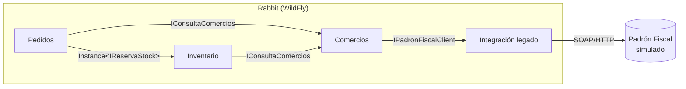
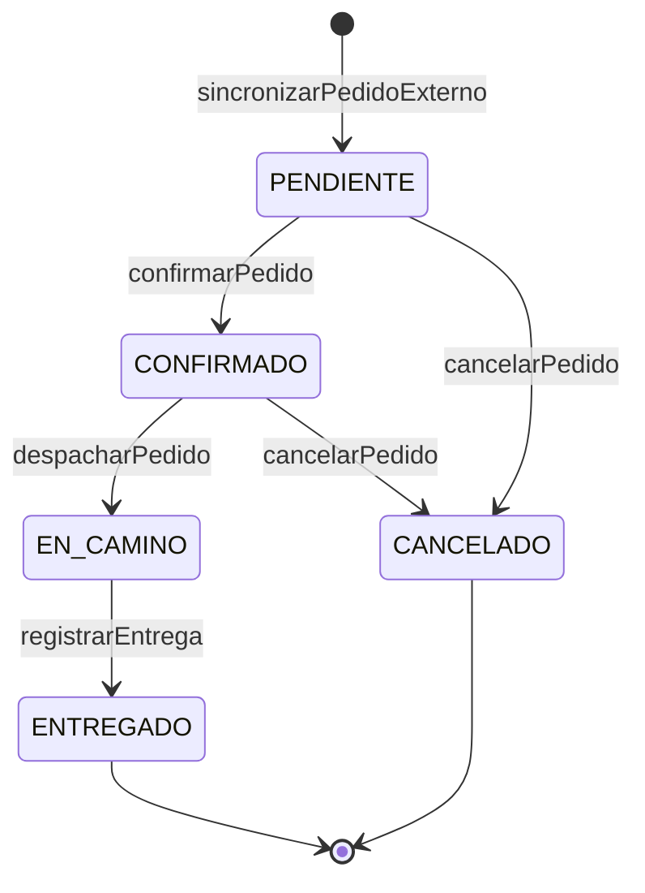

# Arquitectura

## Capas

Cada componente se organiza en tres capas con dependencia en un solo
sentido: **Presentación → Negocio → Datos**.

| Capa | Tecnología | Responsabilidad | Paquete |
|---|---|---|---|
| Presentación | JSF (`@Named` + `@ViewScoped`), Facelets | Mostrar y capturar datos. Sin reglas de negocio. | `presentacion/` |
| Negocio | EJB (`@Stateless`, `@Stateful`, `@Singleton`, `@MessageDriven`) | Reglas del dominio, transacciones, seguridad, orquestación entre componentes | `negocio/` |
| Datos | JPA / Hibernate | Persistencia. Única capa que toca el `EntityManager` | `datos/`, `datos/model/` |
| (transversal) | POJOs | Objetos que cruzan capas y componentes | `dto/` |

**Por qué así:** la vista nunca ve entidades JPA (evita
`LazyInitializationException` y acopla la vista al esquema), y las reglas
viven en un solo lugar (el EJB), sin importar si las invoca una pantalla,
un timer o un MDB.

## Componentes

Cada componente expone interfaces `@Local` separadas por uso (lectura vs.
escritura) y nunca expone sus entidades ni sus excepciones internas a
otro componente. Las referencias entre componentes se guardan como IDs
(`Long idComercio`), no como relaciones JPA.

| Componente | Estado | Interfaces | Tipo de EJB | Por qué ese tipo |
|---|---|---|---|---|
| Comercios | Implementado | `IRegistroComercios`, `IConsultaComercios` | `@Stateless` | Cada operación recibe todo lo que necesita; el estado vive en la base |
| Inventario | Implementado | `IConsultaStock` (`@Stateless`), `IReservaStock` | `@Stateful` | La reserva es una conversación: `reservarStock` y `confirmarReserva` operan sobre la misma instancia |
| Pedidos | Implementado | `IGestionPedidos`, `ISeguimientoPedido` | `@Stateless` (Facade) | El estado del pedido vive en la base; ninguna operación depende de una llamada anterior |
| Seguridad | Implementado | `IRegistroUsuarios`, `IConsultaUsuarios` | `@Stateless` | Idem Comercios |
| Integración legado | Implementado | `IPadronFiscalClient` | `@Stateless` | Cliente SOAP sin estado de conversación |
| Pagos y Cobranzas | Planificado (solo interfaz) | `IRegistroCobros` | `@Stateless` | El cobro queda registrado en la base; se suma a la transacción del llamador |
| Repartidores | Planificado (solo interfaz) | `IAsignacionRepartidores` | `@Stateless` | La disponibilidad del repartidor es un dato persistido, no de sesión |
| Notificaciones | Planificado | suscriptor del tópico | `@MessageDriven` | Reacciona a eventos, no la llama nadie |
| Ruteo, Transportistas | Entrega Final | — | — | — |

### Operaciones por componente (implementado)

| Componente | Interfaz | Operaciones | Quién la usa |
|---|---|---|---|
| Comercios | `IRegistroComercios` | `registrarComercio`, `actualizarDatosFiscales`, `darDeBajaComercio`, `reactivarComercio`, `eliminarComercio`, `registrarPuntoPicking`, `darDeBajaPuntoPicking`, `reactivarPuntoPicking` | `ComercioBean`, `PuntoPickingBean` |
| Comercios | `IConsultaComercios` | `obtenerComercio`, `listarTodos`, `listarPuntosPicking`, `listarPuntosPickingDeComercio`, `validarComercioActivo` | Vistas, Inventario, Pedidos |
| Inventario | `IConsultaStock` | `registrarDeposito`, `listarDepositos`, `obtenerDeposito`, `listarDepositosConStock`, `registrarItem`, `listarItemsPorDeposito` / `PorComercio` / `PorComercioYDeposito`, `consultarDisponibilidad`, `listarHistorialReservas` | `DepositoBean`, `ItemInventarioBean`, `HistorialReservasBean`, `PedidoBean` |
| Inventario | `IReservaStock` | `reservarStock`, `confirmarReserva`, `liberarReserva`, `extenderReserva`, `obtenerReservaActual`, `hayReservaVigente`, `registrarDevolucion` | `ReservaBean`, Pedidos |
| Pedidos | `IGestionPedidos` | `registrarPedidoExterno`, `sincronizarPedidoExterno`, `descartarPedidoExterno`, `confirmarPedido`, `despacharPedido`, `registrarEntrega`, `cancelarPedido` | `PedidoBean`, MDB, timer |
| Pedidos | `ISeguimientoPedido` | `listarPedidosExternos`, `consultarEstadoPedido`, `listarTodos`, `listarPedidosDeComercio` | `PedidoBean` |
| Seguridad | `IRegistroUsuarios` | `registrarUsuario`, `darDeBaja`, `puedeElegirRol` | `UsuarioBean` |
| Seguridad | `IConsultaUsuarios` | `listarTodos`, `obtenerUsuario` | `UsuarioBean` |

Otros detalles de cada componente:

- **Inventario:** `IReservaStock` mantiene la reserva abierta entre
  requests con `@StatefulTimeout`; `BarredorDeReservas` (`@Schedule`)
  libera las reservas vencidas que el usuario no resolvió.
- **Pedidos:** un pedido es multi-línea (`LineaPedido`). Con origen
  `STOCK_CONSIGNADO` cada línea reserva y confirma stock en su propia
  instancia de `IReservaStock`; con `PUNTO_PICKING` solo se valida que el
  punto de picking esté activo. Al cancelar, solo se devuelve el stock de
  las líneas con `idReservaStock`.
- **Seguridad:** `LoginBean` y `SesionBean` no pasan por una interfaz de
  negocio: hablan directo con el `SecurityContext` de WildFly.

### Dependencias entre componentes (implementadas)

## Mapa de integración

| Tramo | Mecanismo | Estado | Detalle |
|---|---|---|---|
| ERP del comercio → Rabbit | Formulario JSF (simulación) | Implementado | Se reemplaza por REST |
| ERP del comercio → Rabbit | REST `POST /api/pedidos-externos` | Planificado | [MENSAJERIA-SINCRONICA.md](MENSAJERIA-SINCRONICA.md) |
| Alta de pedido externo → sincronización | Cola JMS `cola.pedidos.externos` | Implementado | [MENSAJERIA-ASINCRONICA.md](MENSAJERIA-ASINCRONICA.md) |
| Comercios → Padrón Fiscal | SOAP | Implementado | [MENSAJERIA-SINCRONICA.md](MENSAJERIA-SINCRONICA.md) |
| Cambio de estado del pedido → Notificaciones, Pagos | Tópico JMS `topico.pedidos.estado` | Planificado | [MENSAJERIA-ASINCRONICA.md](MENSAJERIA-ASINCRONICA.md) |
| Pedidos → Comercios, Inventario, Pagos, Repartidores | Llamada local EJB | Parcial | No es integración entre sistemas: mismo proceso |

### Criterio sincrónico vs. asincrónico

| | Asincrónico (JMS) | Sincrónico (SOAP / REST) |
|---|---|---|
| Caso en Rabbit | Sincronizar pedido externo; avisar cambios de estado | Validar CUIT; recibir un pedido del ERP |
| ¿El proceso puede seguir sin la respuesta? | Sí | No |
| Si el otro lado no contesta | El mensaje espera o se reintenta (y hay polling de respaldo) | Hay que decidirlo explícitamente (timeout + degradación) |
| Acoplamiento | Solo al formato del mensaje | Temporal + contrato |

## Máquina de estados del pedido

Implementada en `EstadoPedido.puedePasarA(...)`. Todo cambio de estado de
un pedido existente pasa por `PedidoService.cambiarEstado(...)`, que
valida la transición y dispara el evento `EstadoPedidoCambiado`.

- **EN_CAMINO no se puede cancelar:** la mercadería ya salió con el
  repartidor, no está en el depósito para devolver el stock.
- **Por qué centralizar las transiciones:** la regla está en un solo
  lugar, y protege contra acciones fuera de orden (un "entregar" sobre un
  pedido cancelado, o eventos que llegan desordenados).

## Datos del pedido que vienen del ERP

`importe` y `medioPago` (`PREPAGO` / `CONTRA_ENTREGA`) llegan en el
pedido externo y pasan tal cual al `Pedido` al sincronizar. Rabbit no
calcula precios: ver ADR-004 en [DECISIONES.md](DECISIONES.md).
