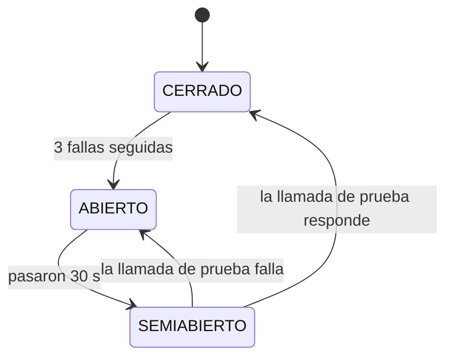

# Desafíos opcionales

Qué desafíos opcionales de la consigna encara Rabbit, cómo se cumplen y
cómo se muestran en la defensa.

| Desafío | Estado |
|---|---|
| [Resiliencia ante fallas](#1-resiliencia-ante-fallas) | Cumple |
| [Escalabilidad horizontal bajo carga simulada](#2-escalabilidad-horizontal-bajo-carga-simulada) | En curso: el componente ya escala y la prueba está armada; falta correr la medición |
| [Architecture Decision Records](#3-architecture-decision-records) | Cumple: 14 ADR en [DECISIONES.md](DECISIONES.md); acá se desarrollan 3 con sus alternativas |
| Heterogeneidad tecnológica | No encarado |

## 1. Resiliencia ante fallas

**Qué se pide:** que una falla en una parte del sistema no tire abajo al
resto, y que el sistema se recupere solo cuando la falla termina.

### Fallas contempladas

| Qué falla | Qué pasa en Rabbit | Mecanismo |
|---|---|---|
| El banco legado no responde | El pedido prepago no se confirma y sigue PENDIENTE; el resto de la plataforma sigue funcionando | Timeout de 5 s en el cliente SOAP |
| El banco sigue caído | Después de 3 fallas seguidas, los pedidos prepago fallan al instante, sin esperar el timeout; a los 30 s se prueba una llamada y, si el banco volvió, todo sigue normal | Circuit breaker (ADR-011) |
| El banco cobró pero Rabbit falla después (por ejemplo, no hay repartidor) | Rabbit deshace su parte y le pide al banco que devuelva la plata | Transacción compensatoria (ADR-010) |
| Se pierde el mensaje de un pedido del ERP (broker caído, mensaje sin enviar) | El pedido se sincroniza igual en menos de un minuto | Polling de respaldo sobre la cola (ADR-001) |
| Un suscriptor del tópico está caído (por ejemplo, en un redeploy) | Recibe los cambios de estado cuando vuelve; no se pierde ningún cobro contra entrega | Suscripciones durables (ADR-009) |
| Un mensaje llega dos veces | Se procesa una sola vez | Sincronización y cobro contra entrega idempotentes |

### El circuit breaker, en detalle

Sin él, con el banco colgado, cada confirmación de un pedido prepago
bloquea un hilo del servidor durante los 5 s del timeout. Con muchos
usuarios a la vez, esos hilos se agotan y la caída del banco termina
afectando pantallas que no tienen nada que ver con cobrar (falla en
cascada).



Implementación: `CircuitBreakerBanco` (`@Singleton`), consultado por
`BancoClient` antes de cada llamada. Detalle en
[MENSAJERIA-SINCRONICA.md](MENSAJERIA-SINCRONICA.md#circuit-breaker).

### Resultado medido

Con el banco simulado colgado y 4 pedidos prepago confirmados seguidos,
en la app desplegada:

| Intento | Tiempo hasta la respuesta | Estado del circuito |
|---|---|---|
| 1 | 5,2 s (timeout) | CERRADO, 1 falla |
| 2 | 5,2 s (timeout) | CERRADO, 2 fallas |
| 3 | 5,2 s (timeout) | Se abre |
| 4 | **0,2 s** (no se llama al banco) | ABIERTO |

Con el banco repuesto, pasados 30 s, la siguiente confirmación prueba al
banco, cobra en 1,9 s y el circuito se cierra solo.

### Cómo mostrarlo en la defensa

```bash
# 1. Colgar el banco simulado (tarda 10 s y no procesa nada)
$WILDFLY_HOME/bin/jboss-cli.sh --connect --command="/system-property=rabbit.banco.simular.caida:add(value=true)"
# 2. Confirmar 4 pedidos prepago desde Pedidos: los 3 primeros tardan 5 s, el 4.º falla al instante
# 3. Reponer el banco
$WILDFLY_HOME/bin/jboss-cli.sh --connect --command="/system-property=rabbit.banco.simular.caida:remove"
# 4. Esperar 30 s y confirmar otro: cobra y el circuito se cierra
```

En el log se ven las transiciones con el prefijo `[Pagos][Circuito]`.

### Limitaciones

- Si el banco cobra pero la respuesta se pierde por el timeout, ese cobro
  queda sin registrar en Rabbit (lo resolvería una clave de idempotencia).
- Si el banco no responde a una reversa, queda logueada para hacerla a
  mano.
- El estado del circuito vive en cada servidor: en un cluster, cada nodo
  descubre la caída por su cuenta.

## 2. Escalabilidad horizontal bajo carga simulada

**Qué se pide:** escalar horizontalmente un componente bajo carga
simulada y mostrar la mejora medida.

### Componente elegido: el consumidor de la cola de pedidos del ERP

Cada pedido que manda el ERP de un comercio entra por
`cola.pedidos.externos` y lo convierte en pedido real
`PedidoExternoListener`. Es el punto de entrada de toda la operación: si
un comercio grande manda muchos pedidos juntos (por ejemplo, al cierre de
un día de ventas), la cola se llena y los pedidos tardan en aparecer.

Se escala con el patrón **consumidores competidores**: varias instancias
del consumidor leen la misma cola y el broker le da cada mensaje a una
sola. No hace falta cambiar código ni coordinar las instancias, y el
procesamiento ya era seguro en paralelo: `sincronizarPedidoExterno`
bloquea la fila con `PESSIMISTIC_WRITE` y es idempotente (ADR-001).

La cantidad de instancias se fija con la system property
`rabbit.cola.consumidores` (en `WEB-INF/jboss-ejb3.xml`, que la aplica
como `maxSession` del MDB; 15 por defecto). Se lee al desplegar:

```bash
$WILDFLY_HOME/bin/jboss-cli.sh --connect --command="/system-property=rabbit.cola.consumidores:add(value=4)"
$WILDFLY_HOME/bin/jboss-cli.sh --connect --command="/deployment=Rabbit.war:redeploy"
```

Dentro de un servidor, cada consumidor es una sesión JMS con su propio
hilo. Entre servidores funciona igual: un segundo WildFly conectado al
mismo broker suma consumidores a la misma cola (ver Limitaciones).

### Cómo se mide

El script [`scripts/prueba_escalabilidad.py`](../scripts/prueba_escalabilidad.py)
hace, para cada cantidad de consumidores:

1. Fija `rabbit.cola.consumidores` y redespliega.
2. Pausa el timer de respaldo (`rabbit.sincronizador.pausado=true`), para
   que no procese pedidos de la carga y falsee la medición.
3. Manda 10 pedidos de calentamiento, que no se miden.
4. Pausa la cola, manda los 100 pedidos de la carga por la API del ERP y
   la reanuda. Así se mide solo el procesamiento, no el envío.
5. Toma del log del servidor la hora en que se sincronizó cada pedido y
   qué hilo lo procesó.

Métricas: tiempo total hasta procesar los 100, pedidos por segundo,
espera media y percentil 95 desde que se reanuda la cola, y cantidad de
hilos que efectivamente procesaron (para confirmar el paralelismo).

### Resultados

> **Pendiente de medición.** La prueba está armada pero todavía no se
> corrió completa: hace falta el comercio `[PRUEBA]` activo y un usuario
> administrador para reactivarlo. Los valores se completan con la salida
> del script.

| Consumidores | Tiempo total | Pedidos/s | Espera media | Espera p95 | Hilos que procesaron | Mejora |
|---|---|---|---|---|---|---|
| 1 | — | — | — | — | — | base |
| 4 | — | — | — | — | — | — |
| 8 | — | — | — | — | — | — |

Para correrla (el script imprime esta misma tabla al terminar):

```bash
export WILDFLY_HOME=... RABBIT_ERP_USUARIO=... RABBIT_ERP_CLAVE=...
python3 scripts/prueba_escalabilidad.py 1 4 8 --pedidos 100
```

### Hallazgo: el techo lo pone la base de datos

Al preparar la prueba, la primera carga falló con
`EMAXCONNSESSION: max clients reached in session mode - max clients are
limited to pool_size: 15`. El pooler de Supabase en modo sesión admite
como máximo **15 conexiones para todo el proyecto**, y el pool de WildFly
permitía hasta 20.

Consecuencias:

- **Sumar consumidores no escala sin límite:** cada consumidor usa una
  conexión mientras procesa. Con el pool en 10 (valor usado para la
  prueba), más de 10 consumidores solo esperan conexión.
- **El cupo se comparte:** varios integrantes con la app levantada contra
  la misma base compiten por esas 15 conexiones.
- **Configuración recomendada:** `max-pool-size` del datasource `RabbitDS`
  en 10 o menos:

  ```bash
  $WILDFLY_HOME/bin/jboss-cli.sh --connect --command="/subsystem=datasources/data-source=RabbitDS:write-attribute(name=max-pool-size,value=10)"
  $WILDFLY_HOME/bin/jboss-cli.sh --connect --command=":reload"
  ```

Para escalar más allá haría falta el Transaction Pooler de Supabase
(incompatible con el arranque de Hibernate, ver README) o una base con
más conexiones.

### Limitaciones

- La prueba escala instancias dentro de un servidor. En varios servidores
  el mecanismo es el mismo, pero no se probó: el broker embebido es de
  cada WildFly y habría que compartir uno.
- En un cluster, los usuarios (archivos del realm) y el estado del
  circuit breaker son de cada servidor.
- La latencia hasta Supabase domina el tiempo de cada pedido: los números
  dependen de la red desde donde se corra.

## 3. Architecture Decision Records

Los 14 ADR del proyecto están en [DECISIONES.md](DECISIONES.md). Estos
tres son los de más peso en la arquitectura; acá se desarrollan con las
alternativas consideradas y por qué se descartaron.

### ADR-001: Cola JMS con polling de respaldo para sincronizar pedidos

**Contexto.** Los pedidos llegan del ERP de cada comercio y hay que
convertirlos en pedidos reales (validar comercio, reservar stock). Al
principio solo un timer revisaba la tabla cada minuto: hasta un minuto de
demora por pedido.

**Decisión.** Cada pedido recibido se publica en `cola.pedidos.externos`
y un MDB lo sincroniza en el momento. El timer (`SincronizadorDePedidos`)
queda como red de contención para los pedidos cuyo mensaje se perdió.

| Alternativa | Por qué se descartó |
|---|---|
| Solo polling (lo que había) | Hasta un minuto de demora, y todo el trabajo concentrado en una pasada |
| Solo cola, sin polling | Si el broker falla o el mensaje no sale, el pedido queda huérfano para siempre |
| Llamada sincrónica desde la API | El ERP esperaría la reserva de stock en cada pedido, y una base lenta o caída rechazaría pedidos válidos |
| Patrón outbox o transacción XA entre base y broker | Garantiza que el mensaje salga, pero agrega una tabla y un proceso de envío (outbox) o un coordinador de dos fases (XA); el polling ya cubre esa ventana con mucho menos |

**Consecuencias.** Latencia casi nula en el caso normal y ningún pedido
perdido. A cambio hay dos disparadores sobre la misma fila, y por eso la
sincronización bloquea la fila y es idempotente. Esta misma decisión es
la que permite escalar el consumidor (sección 2).

### ADR-010: Cobro por SOAP en un banco legado, con reversa compensatoria

**Contexto.** Para confirmar un pedido prepago hay que cobrarlo en un
banco legado. Una vez que el banco cobró, un rollback de Rabbit no lo
deshace: si después la confirmación falla (por ejemplo, no hay
repartidor), el cliente queda cobrado por un pedido que no se confirmó.

**Decisión.** Se cobra dentro de la transacción de confirmación. Cada
cobro dispara un evento; si la transacción se deshace, un observer
(`ReversasBancarias`, `AFTER_FAILURE`) le pide al banco la reversa. Al
anular un cobro, la reversa se pide recién después del commit
(`AFTER_SUCCESS`).

| Alternativa | Por qué se descartó |
|---|---|
| Transacción distribuida (XA / 2PC) con el banco | Un sistema legado expuesto por SOAP no participa de la transacción de Rabbit |
| Cobrar después de asignar el repartidor | Achica la ventana pero no la elimina (el commit puede fallar igual) y deja reservado un repartidor para un pedido que el banco puede rechazar |
| Cobrar de forma asincrónica, después de confirmar | El pedido quedaría confirmado sin saber si se cobró; habría que "desconfirmarlo" si el banco rechaza |
| No compensar: devolver a mano | Un pedido fallido deja al cliente cobrado hasta que alguien lo note |

**Consecuencias.** El cliente nunca queda cobrado por un pedido que no se
confirmó, salvo que falle la reversa (queda logueada). Sin respuesta del
banco el pedido no se confirma. Queda como limitación el cobro que se
concreta pero cuya respuesta se pierde por timeout.

### ADR-011: Circuit breaker propio frente al banco legado

**Contexto.** Con el banco caído o colgado, cada confirmación prepago
bloquea un hilo durante los 5 s del timeout. Con carga, la caída del
banco agota los hilos del servidor y afecta al resto de la plataforma.

**Decisión.** `BancoClient` consulta a `CircuitBreakerBanco` antes de
cada llamada. Tras 3 fallas seguidas se abre y se contesta "banco no
disponible" al instante; a los 30 s deja pasar una llamada de prueba.

| Alternativa | Por qué se descartó |
|---|---|
| `@CircuitBreaker` de MicroProfile Fault Tolerance | No viene en la configuración `standalone-full` de WildFly que usa Rabbit; habría que cambiar de configuración solo por esto |
| Solo el timeout (lo que había) | Protege un pedido, pero no evita que muchos pedidos juntos agoten los hilos |
| Reintentar automáticamente | Con el banco caído multiplica la carga y la espera; y reintentar un cobro sin clave de idempotencia puede cobrar dos veces |
| Bulkhead (limitar las llamadas simultáneas al banco) | Contiene el daño pero igual hace esperar a cada usuario el timeout completo; el circuit breaker corta la espera |

**Consecuencias.** Con el banco caído, los pedidos prepago fallan en
milisegundos y el resto de Rabbit no se degrada (medido en la sección 1).
Durante los 30 s de espera se rechazan confirmaciones aunque el banco ya
haya vuelto. Cada servidor tiene su propio circuito.
