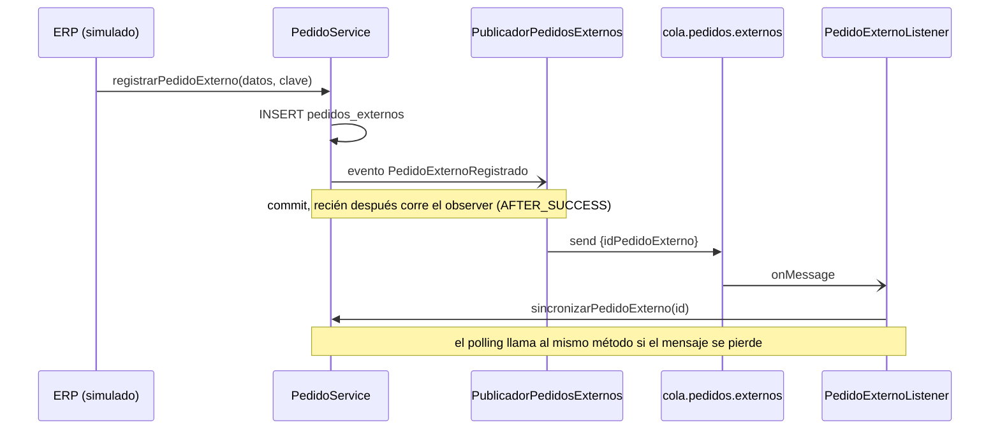
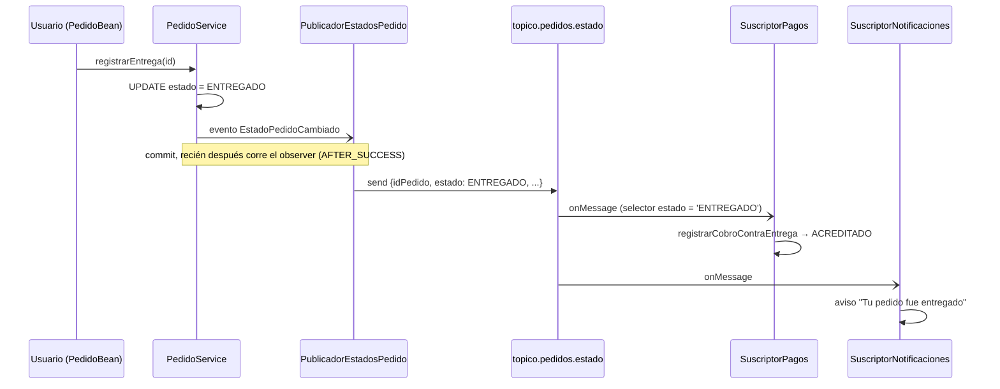

# Mensajería asincrónica

Se usa cuando **el proceso puede seguir sin esperar la respuesta**. Si
el otro lado no está, el mensaje espera; no hay timeout bloqueante.

**Broker:** ActiveMQ Artemis embebido en WildFly (perfil
`standalone-full.xml`; con `standalone.xml` el deploy falla). La connection
factory y los destinos los declara la propia aplicación
(`@JMSConnectionFactoryDefinition` / `@JMSDestinationDefinition`), con
conector `in-vm`: sin él WildFly usa el `http-connector`, que exige
credenciales (`AMQ229031 Unable to validate user`).

## Cola `cola.pedidos.externos` (implementado)

**Problema de negocio:** cuando llega un pedido del ERP, convertirlo en
pedido real (validar comercio, reservar stock) no debería hacer esperar a
quien lo registró.

**Por qué punto a punto (Queue) y no Topic:** cada pedido se tiene que
sincronizar **una sola vez**; con varios consumidores recibiendo el mismo
mensaje se duplicaría la reserva de stock.

| Clase | Rol |
|---|---|
| `PedidoExternoRegistrado` | Evento CDI que dispara el alta |
| `PublicadorPedidosExternos` | Productor JMS + declaración de la cola |
| `PedidoExternoListener` | Consumidor (`@MessageDriven`) |
| `SincronizadorDePedidos` | Polling de respaldo (`@Schedule`, cada minuto) |

**Mensaje:** `TextMessage` con body `{"idPedidoExterno": <Long>}` y
propiedad JMS `origen` (permitiría filtrar sin leer el body).

**Cuántos consumidores:** varias instancias de `PedidoExternoListener`
compiten por la cola (cada mensaje lo procesa una sola). La cantidad se
fija con la system property `rabbit.cola.consumidores` (`maxSession`, en
`WEB-INF/jboss-ejb3.xml`; 15 por defecto) y se lee al desplegar. Con
`rabbit.sincronizador.pausado=true` el polling de respaldo no corre: se
usa para medir la cola sola. Ver la prueba de escalabilidad en
[DESAFIOS-OPCIONALES.md](DESAFIOS-OPCIONALES.md#2-escalabilidad-horizontal-bajo-carga-simulada).

### Garantías y manejo de fallas

| Situación | Qué pasa |
|---|---|
| El broker falla al publicar | Se loguea; el pedido ya está guardado y lo levanta el polling (≤ 1 min) |
| El consumidor no está | El mensaje espera en la cola |
| Cola y polling llegan a la vez | Lock `PESSIMISTIC_WRITE` + flag `sincronizado`: el segundo recibe `PedidoYaSincronizadoException` y la ignora |
| Falla de negocio (comercio de baja, sin stock) | Se descarta el pedido con motivo y el mensaje se consume (reintentarlo no lo arregla) |
| Mensaje ilegible | Se loguea y se consume |
| Error transitorio (base caída) | Se relanza; el broker reintenta la entrega |

**Orden:** no importa, cada mensaje es independiente (un ID por pedido).

## Tópico `topico.pedidos.estado` (implementado)

**Problema de negocio:** cuando un pedido cambia de estado, a más de un
componente le interesa, por motivos distintos:

| Suscriptor | Qué hace | Por qué |
|---|---|---|
| Notificaciones | Avisa al comercio del cambio | Seguimiento del pedido |
| Pagos y Cobranzas | Con `ENTREGADO` y `CONTRA_ENTREGA`, acredita el cobro | El repartidor cobra al entregar |

**Por qué Topic y no Queue:** el mismo evento lo necesitan dos
consumidores independientes (1 → N). Con una cola solo lo recibiría uno.
Pedidos no conoce a los suscriptores: se puede agregar otro sin tocarlo.

| Clase | Rol |
|---|---|
| `EstadoPedidoCambiado` | Evento CDI que dispara `PedidoService` en cada cambio de estado |
| `PublicadorEstadosPedido` | Productor JMS + declaración del tópico (`AFTER_SUCCESS` + `NOT_SUPPORTED`, igual que la cola) |
| `SuscriptorPagosEstadoPedido` | MDB de Pagos, filtra `estado = 'ENTREGADO'` |
| `SuscriptorNotificacionesEstadoPedido` | MDB de Notificaciones, recibe todos los cambios |

**Mensaje:** `TextMessage` con body
`{"idPedido", "idComercio", "estado", "fechaCambio"}` y propiedades JMS
`estado` e `idPedido`. Las propiedades permiten filtrar con un
`messageSelector` sin leer el body: el broker ni siquiera le entrega a
Pagos los cambios que no son `ENTREGADO`.

### Suscripciones durables

Las dos suscripciones son **durables** (`clientId` +
`subscriptionName`): si un suscriptor no está activo cuando se publica un
cambio —por un redeploy, por ejemplo—, el broker guarda el mensaje y se
lo entrega al volver. `shareSubscriptions=true` permite que las varias
instancias del pool del MDB consuman de la misma suscripción.

Se probó deteniendo la entrega del MDB de Pagos (`stop-delivery` en la
consola de WildFly), entregando un pedido contra entrega (el cobro quedó
`PENDIENTE`) y reanudándola: el cobro pasó a `ACREDITADO` al instante.

### Garantías y manejo de fallas

| Situación | Qué pasa |
|---|---|
| El broker falla al publicar | Se loguea; el cambio de estado ya está guardado. Se pierde el aviso (no hay polling de respaldo, a diferencia de la cola) |
| Un suscriptor no está activo | La suscripción durable guarda el mensaje hasta que vuelve |
| El mismo evento llega dos veces | Pagos es idempotente (si ya está `ACREDITADO` no hace nada, con bloqueo pesimista sobre el cobro). Notificaciones descarta el repetido por `fechaCambio` |
| Los eventos llegan desordenados | Notificaciones guarda la `fechaCambio` por pedido e ignora los más viejos. A Pagos no le afecta: `ENTREGADO` es final |
| Mensaje ilegible | Se loguea y se consume |
| Error transitorio en Pagos (base caída) | Se relanza; el broker reintenta la entrega |
