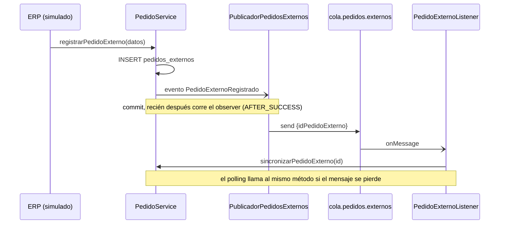

# Mensajería asincrónica

Se usa cuando **el proceso puede seguir sin esperar la respuesta**. Si
el otro lado no está, el mensaje espera; no hay timeout bloqueante.

**Broker:** ActiveMQ Artemis embebido en WildFly (perfil
`standalone-full.xml`; con `standalone.xml` el deploy falla). La connection
factory y los destinos los declara la propia aplicación
(`@JMSConnectionFactoryDefinition` / `@JMSDestinationDefinition`), con
conector `in-vm`: sin él WildFly usa el `http-connector`, que exige
credenciales (`AMQ229031 Unable to validate user`).

## Cola `cola.pedidos.externos` (implementado)

**Problema de negocio:** cuando llega un pedido del ERP, convertirlo en
pedido real (validar comercio, reservar stock) no debería hacer esperar a
quien lo registró.

**Por qué punto a punto (Queue) y no Topic:** cada pedido se tiene que
sincronizar **una sola vez**; con varios consumidores recibiendo el mismo
mensaje se duplicaría la reserva de stock.

| Clase | Rol |
|---|---|
| `PedidoExternoRegistrado` | Evento CDI que dispara el alta |
| `PublicadorPedidosExternos` | Productor JMS + declaración de la cola |
| `PedidoExternoListener` | Consumidor (`@MessageDriven`) |
| `SincronizadorDePedidos` | Polling de respaldo (`@Schedule`, cada minuto) |

**Mensaje:** `TextMessage` con body `{"idPedidoExterno": <Long>}` y
propiedad JMS `origen` (permitiría filtrar sin leer el body).

### Garantías y manejo de fallas

| Situación | Qué pasa |
|---|---|
| El broker falla al publicar | Se loguea; el pedido ya está guardado y lo levanta el polling (≤ 1 min) |
| El consumidor no está | El mensaje espera en la cola |
| Cola y polling llegan a la vez | Lock `PESSIMISTIC_WRITE` + flag `sincronizado`: el segundo recibe `PedidoYaSincronizadoException` y la ignora |
| Falla de negocio (comercio de baja, sin stock) | Se descarta el pedido con motivo y el mensaje se consume (reintentarlo no lo arregla) |
| Mensaje ilegible | Se loguea y se consume |
| Error transitorio (base caída) | Se relanza; el broker reintenta la entrega |

**Orden:** no importa, cada mensaje es independiente (un ID por pedido).

## Tópico `topico.pedidos.estado` (planificado, Entrega 2)

**Problema de negocio:** cuando un pedido cambia de estado, a más de un
componente le interesa, por motivos distintos:

| Suscriptor | Qué hace | Por qué |
|---|---|---|
| Notificaciones | Avisa al comercio del cambio | Seguimiento del pedido |
| Pagos y Cobranzas | Con `ENTREGADO` y `CONTRA_ENTREGA`, efectiviza el cobro | El repartidor cobra al entregar |

**Por qué Topic y no Queue:** el mismo evento lo necesitan dos
consumidores independientes (1 → N). Con una cola solo lo recibiría uno.
Pedidos no conoce a los suscriptores: se puede agregar otro sin tocarlo.

**Mensaje (formato ya definido):** el evento CDI `EstadoPedidoCambiado`
(implementado, ya se dispara en cada cambio de estado) se publica como
JSON: `{idPedido, idComercio, estado, fechaCambio}`. El publicador lo
observará con `AFTER_SUCCESS` + `NOT_SUPPORTED`, igual que la cola.

**Orden:** un MDB no garantiza orden de llegada. Cada suscriptor guarda
la última `fechaCambio` procesada por pedido e ignora los eventos más
viejos. Pagos además es idempotente (si el cobro ya está acreditado, no
hace nada).
