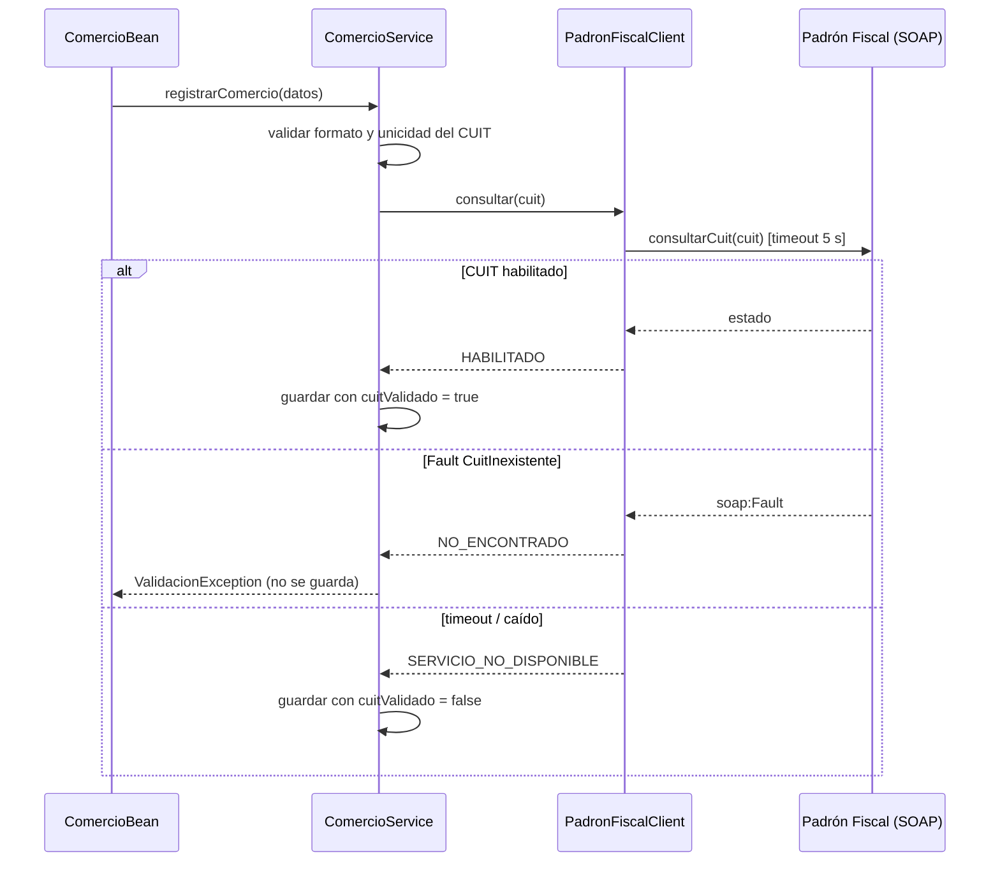

# Mensajería sincrónica

Se usa cuando **el proceso no puede seguir sin la respuesta**. El costo
es el acoplamiento temporal: si el otro lado no contesta, hay que decidir
explícitamente qué hacer.

## SOAP: validación de CUIT contra el Padrón Fiscal (implementado)

**Problema de negocio:** antes de dar de alta un comercio o cambiar sus
datos fiscales, Rabbit necesita saber si el CUIT existe y está habilitado
(caso de referencia: ARCA/AFIP).

**Por qué sincrónico:** el alta depende de esa respuesta; no tiene
sentido guardar el comercio y enterarse después de que el CUIT no existe.

**Por qué SOAP:** el padrón es un sistema legado con contrato WSDL
formal.

### Piezas

| Clase | Rol |
|---|---|
| `PadronFiscalService` | Contrato (SEI) |
| `PadronFiscalServiceImpl` | Proveedor simulado, publicado en el mismo WAR |
| `CuitInexistenteException` + `CuitInexistenteFaultInfo` | El Fault de negocio |
| `IPadronFiscalClient` | Lo único que conoce `ComercioService` |
| `PadronFiscalClient` | Adapter: cliente JAX-WS (proxy dinámico con `Service.getPort`, sin wsimport; WSDL leído una vez y cacheado) |

Endpoint: `http://localhost:8080/Rabbit/PadronFiscalService` (WSDL en `?wsdl`).
Aunque está en el mismo servidor, se consume siempre por SOAP/HTTP.

### Contrato

- Estilo: `document/literal wrapped` (WS-I Basic Profile).
- `targetNamespace`: `http://rabbit.example/legado/padronfiscal`
- Service `PadronFiscalService`, port `PadronFiscalPort`, portType `PadronFiscalPortType`.

| Operación | Entrada | Salida | Fault |
|---|---|---|---|
| `consultarCuit` | `cuit` (`xs:string`, `XX-XXXXXXXX-X`) | `estado`: `cuit`, `razonSocial` (`xs:string`), `habilitado` (`xs:boolean`) | `CuitInexistente` (detail: `cuit`) |

Regla del mock: `20-00000000-0` siempre dispara el Fault; cualquier otro
CUIT con formato válido responde habilitado.

### Secuencia

### Desafío del timeout

- `connectionTimeout` y `receiveTimeout` en 5 s.
- Se separan dos tipos de falla:
  - **De negocio** (el CUIT no existe) → bloquea el alta.
  - **De infraestructura** (el padrón no responde) → no bloquea: se
    guarda con `cuitValidado = false`. Un sistema ajeno caído no debería
    tumbar una operación válida.
- `SERVICIO_NO_DISPONIBLE` no es un Fault del contrato: el timeout lo
  detecta el cliente, no lo responde el servicio.
- **Limitación conocida:** la primera descarga del WSDL (`Service.create`)
  no tiene timeout propio.
- **Limitación conocida:** el cliente no revisa el campo `habilitado` de
  la respuesta; con el mock siempre es `true`.

## REST: entrada de pedidos del ERP (planificado, Entrega 2)

- `POST /api/pedidos-externos` (JAX-RS), body JSON con comercio, origen,
  líneas, importe y medio de pago.
- **Por qué sincrónico:** el ERP necesita saber en el momento si Rabbit
  aceptó el pedido (validación de datos) y con qué ID. La **conversión**
  en pedido real sigue siendo asincrónica (cola), así que la respuesta es
  inmediata: `201 Created` con el ID del pedido externo.
- **Por qué REST y no SOAP:** el ERP es un partner moderno; JSON sobre
  HTTP no le exige generar clientes a partir de un WSDL.
- Reemplaza al formulario JSF que hoy simula el ERP, así queda una
  frontera real entre sistemas.
