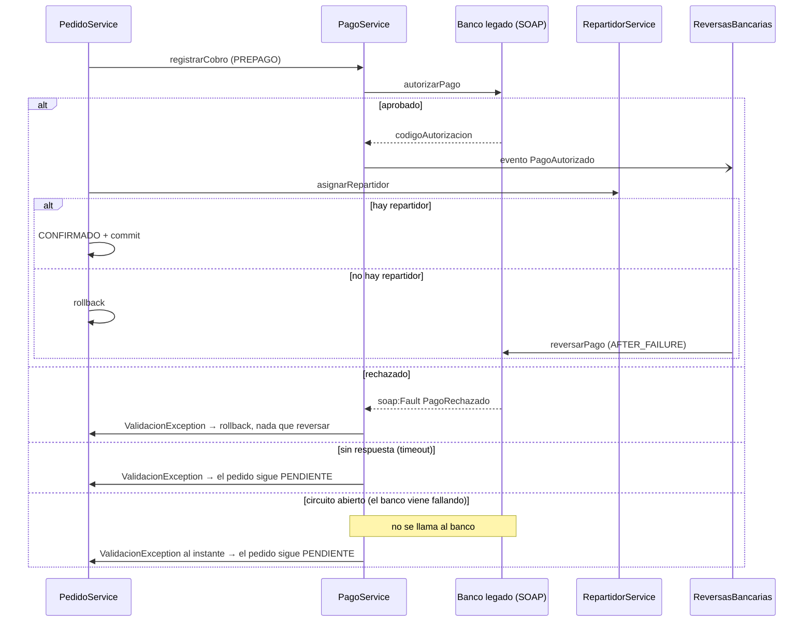
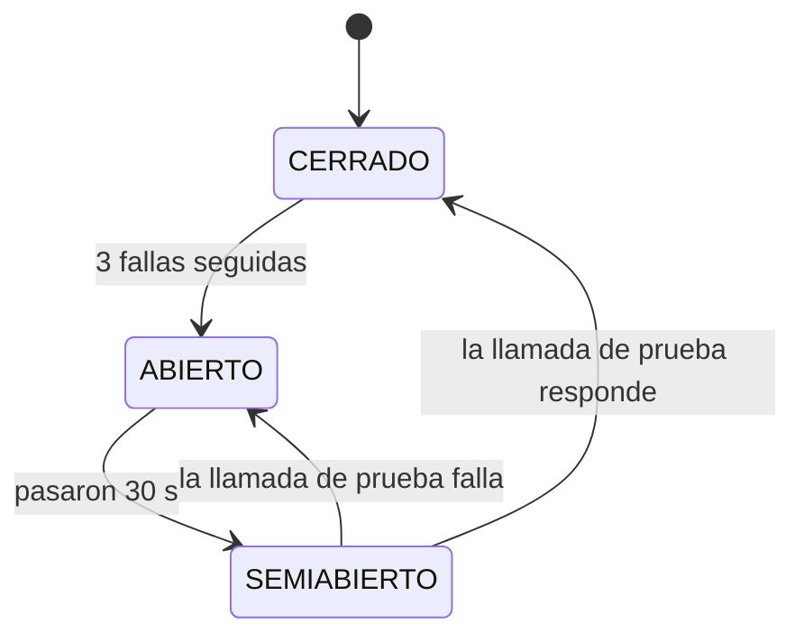
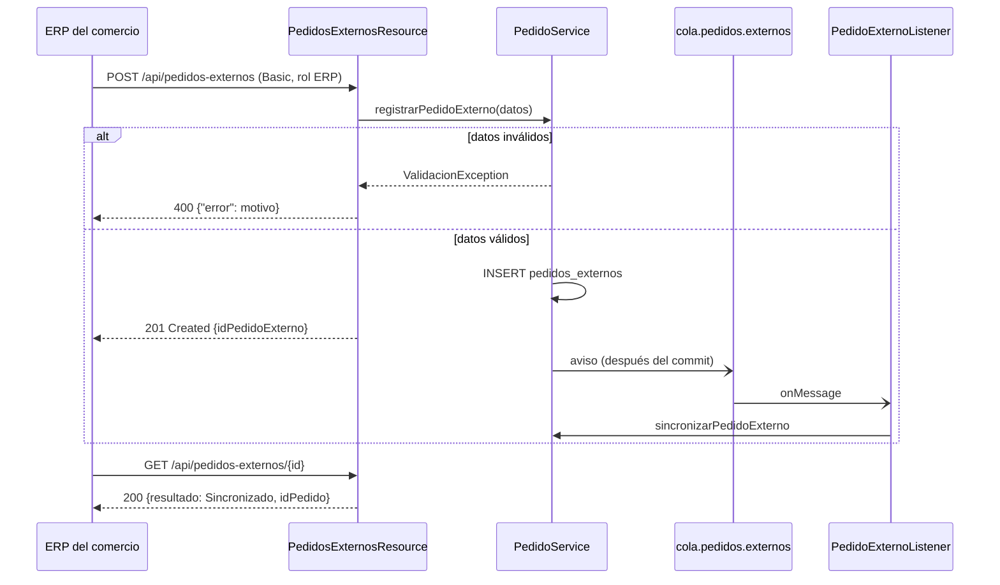

# Mensajería sincrónica

Se usa cuando **el proceso no puede seguir sin la respuesta**. El costo
es el acoplamiento temporal: si el otro lado no contesta, hay que decidir
explícitamente qué hacer.

## SOAP: cobro de pedidos PREPAGO en el banco legado (implementado)

**En una frase:** para confirmar un pedido prepago, Rabbit le pide al
banco que autorice el pago; si después algo falla en Rabbit, el rollback
deshace lo nuestro pero no lo del banco, así que le pedimos al banco que
devuelva la plata.

**Por qué sincrónico:** sin la respuesta del banco no se puede confirmar
el pedido: hay que saber en el momento si se cobró o no.

**Por qué SOAP:** el banco es un sistema legado con contrato WSDL y
errores de negocio tipados (`soap:Fault`).

| Clase | Rol |
|---|---|
| `BancoLegadoService` | Contrato (SEI): `autorizarPago`, `reversarPago` |
| `BancoLegadoServiceImpl` | Banco simulado, publicado en el mismo WAR (el de por defecto) |
| `banco-legado/server.js` | El mismo banco en Node.js, como servicio aparte (heterogeneidad tecnológica, ver [DESAFIOS-OPCIONALES.md](DESAFIOS-OPCIONALES.md#4-heterogeneidad-tecnológica)) |
| `PagoRechazadoException` + `PagoRechazadoFaultInfo` | Fault de negocio con el motivo del rechazo |
| `IBancoClient` | Lo único que conoce `PagoService` |
| `BancoClient` | Adapter: cliente JAX-WS (proxy dinámico con `Service.getPort`, sin wsimport), timeout de 5 s |
| `CircuitBreakerBanco` | Circuit breaker (`@Singleton`): con el banco caído, corta las llamadas sin esperar el timeout |
| `ReversasBancarias` | Pide las reversas (compensación y devoluciones) |

Endpoint: `http://localhost:8080/Rabbit/BancoLegadoService` (WSDL en
`?wsdl`). Aunque está en el mismo servidor, se consume siempre por
SOAP/HTTP. Se puede apuntar a otro banco con la system property
`rabbit.banco.wsdl`.

Regla del banco simulado: un pago de más de **$500.000** se rechaza
(supera el límite); cualquier otro se autoriza con un código `AUT-n`.



### Qué pasa en cada caso

| Caso | Resultado |
|---|---|
| El banco aprueba y todo sale bien | Pedido CONFIRMADO, cobro ACREDITADO con el código del banco |
| El banco rechaza (`soap:Fault`) | El pedido sigue PENDIENTE; el usuario ve el motivo del banco |
| El banco no responde (5 s) | El pedido sigue PENDIENTE: sin respuesta no se sabe si cobró |
| El banco falló 3 veces seguidas (circuito abierto) | El pedido sigue PENDIENTE **al instante**, sin llamar al banco ni esperar el timeout |
| El banco aprueba pero después falla Rabbit (no hay repartidor) | Rollback en Rabbit **y reversa en el banco** (transacción compensatoria) |
| Un administrador cancela un pedido PREPAGO confirmado | Cobro ANULADO y, cuando la cancelación queda confirmada, reversa en el banco |

### Por qué hace falta la reversa

Un rollback de JTA solo deshace lo que Rabbit escribió en su base. El
banco es otro sistema: lo que cobró sigue cobrado. La única forma de
deshacerlo es pedirle la operación inversa. `ReversasBancarias` lo hace
con observers transaccionales, el mismo mecanismo que los publicadores
JMS pero reaccionando al fracaso:

- `PagoAutorizado` + `AFTER_FAILURE`: la transacción que cobró se deshizo.
- `CobroAnulado` + `AFTER_SUCCESS`: la cancelación ya quedó confirmada.

### Circuit breaker

Si el banco está colgado, cada confirmación de un pedido PREPAGO espera
los 5 s del timeout para terminar igual: sin confirmar. Con muchos
usuarios a la vez, esos hilos bloqueados agotan el pool de WildFly y la
caída del banco se contagia al resto de Rabbit. `CircuitBreakerBanco`
lo evita:



- **CERRADO:** las llamadas pasan; se cuentan las fallas seguidas.
- **ABIERTO:** `BancoClient` contesta `NO_DISPONIBLE` sin llamar al banco.
- **SEMIABIERTO:** pasa **una** llamada de prueba; las demás se siguen
  cortando hasta saber si el banco volvió.

Cuenta como falla que el banco **no conteste** (timeout, conexión
rechazada, error del servidor). Un rechazo de negocio (`soap:Fault
PagoRechazado`) es una respuesta, así que cuenta como éxito. Las
reversas pasan por el mismo circuito: con el circuito abierto no se
intentan y quedan logueadas para devolverlas a mano, igual que si el
banco no respondiera.

Cada llamada lleva un ticket con la "generación" del circuito en la que
empezó, y el resultado de una llamada vieja se ignora. Sin eso, una
llamada lenta lanzada con el circuito CERRADO que termina bien mientras
está SEMIABIERTO lo cerraría antes de que responda la llamada de prueba.
El `@Singleton` con `@Lock(WRITE)` evita que dos hilos cambien el estado a
la vez; el ticket evita que un resultado viejo lo cambie tarde.

Umbral y espera se configuran con las system properties
`rabbit.banco.cb.umbral` (3) y `rabbit.banco.cb.espera.ms` (30000).

**Cómo mostrarlo:** el banco simulado se "cuelga" (tarda 10 s, más que
el timeout, y no procesa nada) con la system property `rabbit.banco.simular.caida`, que se
prende y apaga en caliente:

```bash
$WILDFLY_HOME/bin/jboss-cli.sh --connect --command="/system-property=rabbit.banco.simular.caida:add(value=true)"
# confirmar 4 pedidos PREPAGO: los 3 primeros tardan 5 s, el 4.º falla al instante
$WILDFLY_HOME/bin/jboss-cli.sh --connect --command="/system-property=rabbit.banco.simular.caida:remove"
# a los 30 s, el próximo pedido prueba al banco y el circuito se cierra
```

En el log se ven las transiciones con el prefijo `[Pagos][Circuito]`.

### Limitaciones conocidas

- Si el banco cobró pero la respuesta se perdió por timeout, ese cobro
  queda huérfano en el banco. Lo resolvería una clave de idempotencia y
  una consulta de estado antes de reintentar.
- Si el banco no responde a una reversa, se loguea para devolverla a mano
  (lo resolvería un reintento programado).
- El banco simulado guarda sus movimientos en memoria: se pierden al
  redesplegar.
- La primera descarga del WSDL (`Service.create`) no tiene timeout propio.
- El estado del circuito vive en memoria de cada servidor: en un cluster
  cada nodo descubre la caída por su cuenta.

## REST: API para el ERP de los comercios y seguimiento público (implementado)

**En una frase:** el ERP de cada comercio le manda sus pedidos a Rabbit
por una API REST y consulta cómo terminaron; el cliente final puede ver
el estado de su pedido sin loguearse.

| Endpoint | Quién | Qué hace | Respuestas |
|---|---|---|---|
| `POST /api/pedidos-externos` | ERP (rol `ERP`, HTTP Basic) | Registra un pedido externo | `201` + `Location` + `{"idPedidoExterno", "resultado": "Pendiente"}` · `400 {"error"}` · `401` · `403` |
| `GET /api/pedidos-externos/{id}` | ERP (rol `ERP`) | Cómo terminó: `Pendiente`, `Sincronizado` (con `idPedido`) o `Descartado` (con `motivo`) | `200` · `404` |
| `GET /api/seguimiento/{idPedido}` | Público | Estado actual del pedido | `200 {"idPedido", "estado"}` · `404` |

Ejemplo de alta desde el ERP:

```bash
curl -u '<usuario-erp>:<contraseña>' -H "Content-Type: application/json" \
  -d '{"idComercio":1,"origen":"STOCK_CONSIGNADO","lineas":[{"idItem":1,"cantidad":2}],"importe":1800,"medioPago":"PREPAGO","direccionEntrega":"Av. Corrientes 1234, CABA"}' \
  http://localhost:8080/Rabbit/api/pedidos-externos
```

`direccionEntrega` es obligatoria (hasta 200 caracteres): es el destino
de la hoja de ruta del repartidor. Sin ella la API responde `400`.

| Clase | Rol |
|---|---|
| `ApiRest` | Activa JAX-RS bajo `/Rabbit/api` |
| `PedidosExternosResource` | Endpoints del ERP; delega en `IGestionPedidos` / `ISeguimientoPedido` |
| `SeguimientoResource` | Endpoint público de seguimiento |

- **Por qué sincrónico:** el ERP necesita saber en el momento si Rabbit
  aceptó el pedido (validación de datos) y con qué ID. La **conversión**
  en pedido real sigue siendo asincrónica (cola), así que la respuesta es
  inmediata y el ERP consulta el resultado después.
- **Por qué REST y no SOAP:** el ERP es un partner moderno; JSON sobre
  HTTP no le exige generar clientes a partir de un WSDL.
- **Es la misma puerta que la pantalla:** los recursos REST son otra capa
  de presentación del componente Pedidos, como `PedidoBean`; no tienen
  reglas de negocio propias. El formulario "Simular pedido" sigue
  existiendo para la demo.



**Limitación conocida:** cualquier usuario con rol `ERP` puede cargar
pedidos de cualquier comercio. Lo correcto sería asociar cada usuario ERP
a su comercio y validarlo en el recurso.
