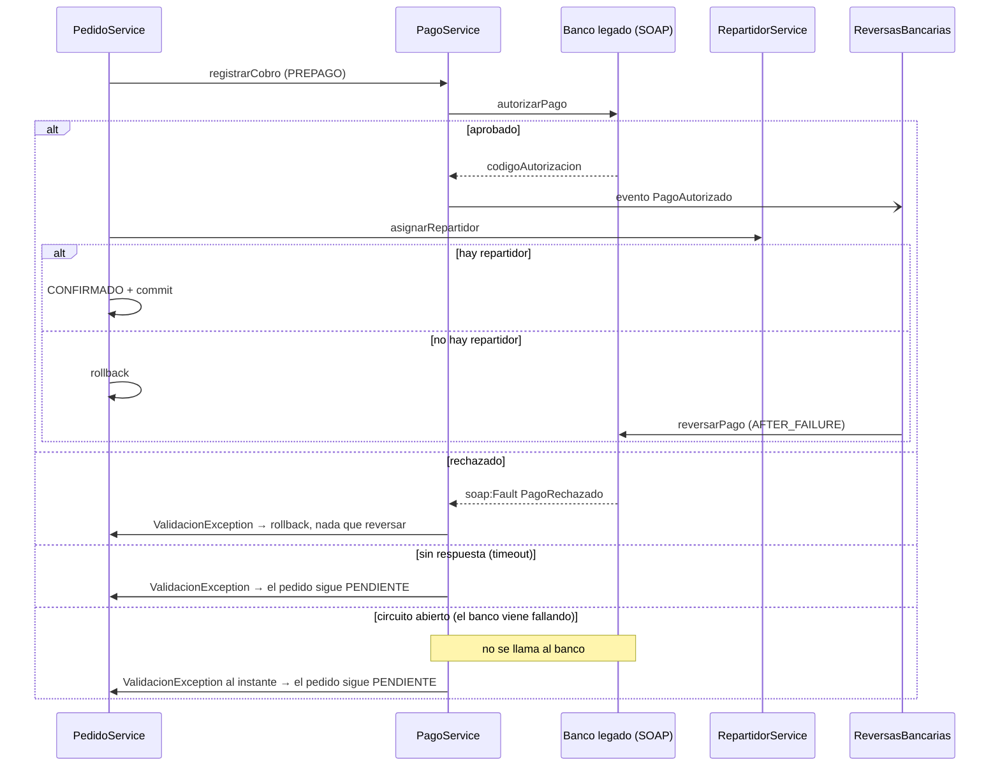
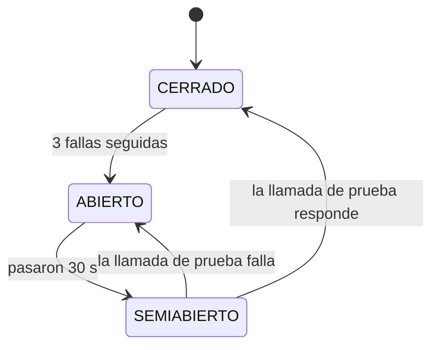
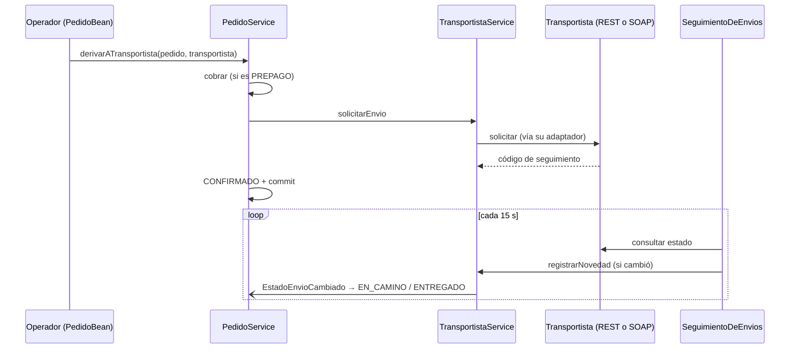
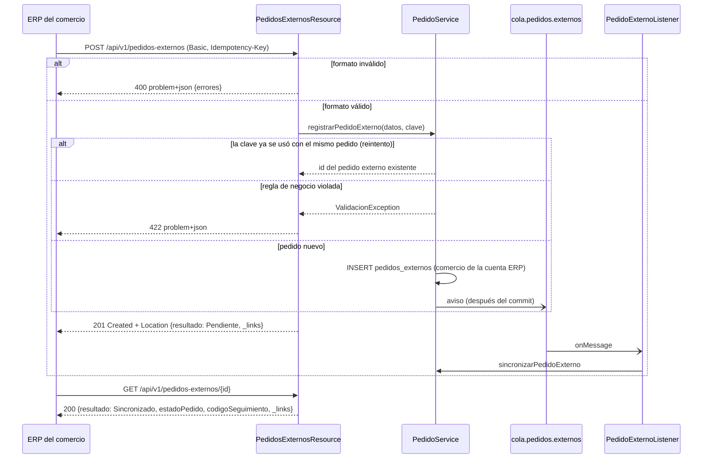

# Mensajería sincrónica

Se usa cuando **el proceso no puede seguir sin la respuesta**. El costo
es el acoplamiento temporal: si el otro lado no contesta, hay que decidir
explícitamente qué hacer.

## SOAP: cobro de pedidos PREPAGO en el banco legado (implementado)

**En una frase:** para confirmar un pedido prepago, Rabbit le pide al
banco que autorice el pago; si después algo falla en Rabbit, el rollback
deshace lo nuestro pero no lo del banco, así que le pedimos al banco que
devuelva la plata.

**Por qué sincrónico:** sin la respuesta del banco no se puede confirmar
el pedido: hay que saber en el momento si se cobró o no.

**Por qué SOAP:** el banco es un sistema legado con contrato WSDL y
errores de negocio tipados (`soap:Fault`).

| Clase | Rol |
|---|---|
| `BancoLegadoService` | Contrato (SEI): `autorizarPago`, `reversarPago` |
| `BancoLegadoServiceImpl` | Banco simulado, publicado en el mismo WAR (el de por defecto) |
| `banco-legado/server.js` | El mismo banco en Node.js, como servicio aparte (heterogeneidad tecnológica, ver [DESAFIOS-OPCIONALES.md](DESAFIOS-OPCIONALES.md#4-heterogeneidad-tecnológica)) |
| `PagoRechazadoException` + `PagoRechazadoFaultInfo` | Fault de negocio con el motivo del rechazo |
| `IBancoClient` | Lo único que conoce `PagoService` |
| `BancoClient` | Adapter: cliente JAX-WS (proxy dinámico con `Service.getPort`, sin wsimport), timeout de 5 s |
| `CircuitBreakerBanco` | Circuit breaker (`@Singleton`): con el banco caído, corta las llamadas sin esperar el timeout |
| `ReversasBancarias` | Pide las reversas (compensación y devoluciones) |

Endpoint: `http://localhost:8080/Rabbit/BancoLegadoService` (WSDL en
`?wsdl`). Aunque está en el mismo servidor, se consume siempre por
SOAP/HTTP. Se puede apuntar a otro banco con la system property
`rabbit.banco.wsdl`.

Regla del banco simulado: un pago de más de **$500.000** se rechaza
(supera el límite); cualquier otro se autoriza con un código `AUT-n`.



### Qué pasa en cada caso

| Caso | Resultado |
|---|---|
| El banco aprueba y todo sale bien | Pedido CONFIRMADO, cobro ACREDITADO con el código del banco |
| El banco rechaza (`soap:Fault`) | El pedido sigue PENDIENTE; el usuario ve el motivo del banco |
| El banco no responde (5 s) | El pedido sigue PENDIENTE: sin respuesta no se sabe si cobró |
| El banco falló 3 veces seguidas (circuito abierto) | El pedido sigue PENDIENTE **al instante**, sin llamar al banco ni esperar el timeout |
| El banco aprueba pero después falla Rabbit (no hay repartidor) | Rollback en Rabbit **y reversa en el banco** (transacción compensatoria) |
| Un administrador cancela un pedido PREPAGO confirmado | Cobro ANULADO y, cuando la cancelación queda confirmada, reversa en el banco |

### Por qué hace falta la reversa

Un rollback de JTA solo deshace lo que Rabbit escribió en su base. El
banco es otro sistema: lo que cobró sigue cobrado. La única forma de
deshacerlo es pedirle la operación inversa. `ReversasBancarias` lo hace
con observers transaccionales, el mismo mecanismo que los publicadores
JMS pero reaccionando al fracaso:

- `PagoAutorizado` + `AFTER_FAILURE`: la transacción que cobró se deshizo.
- `CobroAnulado` + `AFTER_SUCCESS`: la cancelación ya quedó confirmada.

### Circuit breaker

Si el banco está colgado, cada confirmación de un pedido PREPAGO espera
los 5 s del timeout para terminar igual: sin confirmar. Con muchos
usuarios a la vez, esos hilos bloqueados agotan el pool de WildFly y la
caída del banco se contagia al resto de Rabbit. `CircuitBreakerBanco`
lo evita:



- **CERRADO:** las llamadas pasan; se cuentan las fallas seguidas.
- **ABIERTO:** `BancoClient` contesta `NO_DISPONIBLE` sin llamar al banco.
- **SEMIABIERTO:** pasa **una** llamada de prueba; las demás se siguen
  cortando hasta saber si el banco volvió.

Cuenta como falla que el banco **no conteste** (timeout, conexión
rechazada, error del servidor). Un rechazo de negocio (`soap:Fault
PagoRechazado`) es una respuesta, así que cuenta como éxito. Las
reversas pasan por el mismo circuito: con el circuito abierto no se
intentan y quedan logueadas para devolverlas a mano, igual que si el
banco no respondiera.

Cada llamada lleva un ticket con la "generación" del circuito en la que
empezó, y el resultado de una llamada vieja se ignora. Sin eso, una
llamada lenta lanzada con el circuito CERRADO que termina bien mientras
está SEMIABIERTO lo cerraría antes de que responda la llamada de prueba.
El `@Singleton` con `@Lock(WRITE)` evita que dos hilos cambien el estado a
la vez; el ticket evita que un resultado viejo lo cambie tarde.

Umbral y espera se configuran con las system properties
`rabbit.banco.cb.umbral` (3) y `rabbit.banco.cb.espera.ms` (30000).

**Cómo mostrarlo:** el banco simulado se "cuelga" (tarda 10 s, más que
el timeout, y no procesa nada) con la system property `rabbit.banco.simular.caida`, que se
prende y apaga en caliente:

```bash
$WILDFLY_HOME/bin/jboss-cli.sh --connect --command="/system-property=rabbit.banco.simular.caida:add(value=true)"
# confirmar 4 pedidos PREPAGO: los 3 primeros tardan 5 s, el 4.º falla al instante
$WILDFLY_HOME/bin/jboss-cli.sh --connect --command="/system-property=rabbit.banco.simular.caida:remove"
# a los 30 s, el próximo pedido prueba al banco y el circuito se cierra
```

En el log se ven las transiciones con el prefijo `[Pagos][Circuito]`.

Con el banco en Node.js (`banco-legado/`), la caída se prende con
`curl -X POST "http://localhost:8090/admin/caida?activa=true"` y el
circuito se comporta igual (probado: 5,2 s tres veces y 0,3 s la cuarta).
Ver [DESAFIOS-OPCIONALES.md](DESAFIOS-OPCIONALES.md#4-heterogeneidad-tecnológica).

### Limitaciones conocidas

- Si el banco cobró pero la respuesta se perdió por timeout, ese cobro
  queda huérfano en el banco. Lo resolvería una clave de idempotencia y
  una consulta de estado antes de reintentar.
- Si el banco no responde a una reversa, se loguea para devolverla a mano
  (lo resolvería un reintento programado).
- El banco simulado guarda sus movimientos en memoria: se pierden al
  redesplegar.
- La primera descarga del WSDL (`Service.create`) no tiene timeout propio.
- El estado del circuito vive en memoria de cada servidor: en un cluster
  cada nodo descubre la caída por su cuenta.

## Transportistas: REST y SOAP salientes (implementado)

**En una frase:** un pedido que no lleva un repartidor propio se deriva a
una empresa de envíos externa; Rabbit le pide el envío y después le
pregunta cómo va, a cada una en su propia tecnología.

**Por qué sincrónico:** al derivar, Rabbit necesita saber en el momento si
el transportista tomó el envío (y su código de seguimiento) para confirmar
el pedido. El seguimiento posterior es por consulta periódica (polling),
no por aviso: un transportista legado no avisa (ver ADR-016).

| Transportista | Tecnología | Endpoint del simulado | Estados que usa |
|---|---|---|---|
| Moderno | REST con JSON: `POST /envios`, `GET /envios/{codigo}`, `DELETE /envios/{codigo}` | `http://localhost:8080/Rabbit/api/simulador/transportista-rest` | `SOLICITADO`, `EN_TRANSITO`, `ENTREGADO`, `CANCELADO` |
| Legado | SOAP con WSDL: `registrarEnvio`, `consultarEnvio`, `anularEnvio`, fault `EnvioRechazado` | `http://localhost:8080/Rabbit/TransportistaLegadoService?wsdl` | `RECIBIDO`, `EN_VIAJE`, `ENTREGADO`, `ANULADO` |

| Clase | Rol |
|---|---|
| `IAdaptadorTransportista` | Contrato común: `solicitarEnvio`, `consultarEstado`, `cancelarEnvio` |
| `AdaptadorRestTransportista` | Cliente JAX-RS, timeout de 5 s; 201 → tomado, 422 → rechazado |
| `AdaptadorSoapTransportista` | Proxy JAX-WS desde el WSDL, timeout de 5 s; el fault `EnvioRechazado` → rechazado |
| `TransportistaService` | Deriva, cancela y registra las novedades |
| `SeguimientoDeEnvios` | Timer (cada 15 s): consulta los envíos activos |
| `CancelacionesDeEnvios` | Cancela en el transportista (compensación y cancelaciones) |
| `simulador.*` | Los dos transportistas simulados, en el mismo WAR (como el banco) |

Reglas de los simulados: rechazan envíos de más de 50 bultos; un envío
tomado avanza solo con el tiempo (20 s por paso, system property
`rabbit.transportista.simulador.segundos`) y se puede cancelar mientras no
se entregó. Viven en memoria.



| Caso | Resultado |
|---|---|
| El transportista toma el envío | Pedido CONFIRMADO, con transportista y código de seguimiento en lugar de repartidor |
| Lo rechaza (más de 50 bultos) | El pedido sigue PENDIENTE con el motivo; si se había cobrado, se reversa en el banco |
| No responde (5 s) | El pedido sigue PENDIENTE: "probá de nuevo o con otro transportista" |
| Informa EN_TRANSITO / ENTREGADO | El pedido pasa a EN_CAMINO / ENTREGADO; el tópico avisa al comercio y acredita el contra entrega |
| Se cancela el pedido | El envío se cancela en el transportista después del commit |

**Limitaciones:** si el transportista salta un estado entre dos consultas
(por ejemplo, de SOLICITADO a ENTREGADO), el pedido pasa por los dos en la
misma transacción y el comercio recibe solo el aviso de entrega. Los
transportistas no tienen circuit breaker (el seguimiento no bloquea a
nadie: corre en segundo plano). Los simulados guardan todo en memoria.

## REST: API para el ERP de los comercios y seguimiento público (implementado)

**En una frase:** el ERP de cada comercio le manda sus pedidos a Rabbit
por una API REST, consulta cómo terminaron y los puede cancelar; el
cliente final ve el estado de su pedido sin loguearse, con un código de
seguimiento.

El contrato completo (esquemas, ejemplos y errores) está en
[`openapi.yaml`](openapi.yaml): se abre en Swagger Editor o se importa en
Postman.

| Endpoint | Quién | Qué hace | Respuestas |
|---|---|---|---|
| `POST /api/v1/pedidos-externos` | ERP (HTTP Basic) + header `Idempotency-Key` | Registra un pedido externo de **su** comercio | `201` + `Location` · `400` · `401` · `403` · `422` |
| `GET /api/v1/pedidos-externos/{id}` | ERP | Cómo terminó: `Pendiente`, `Sincronizado` (con `idPedido`, `estadoPedido` y `codigoSeguimiento`), `Descartado` (con `motivo`) o `Cancelado` | `200` · `404` |
| `POST /api/v1/pedidos-externos/{id}/cancelacion` | ERP | Cancela el pedido (pendiente de sincronizar, o pedido `PENDIENTE`) | `200` · `404` · `409` |
| `GET /api/v1/seguimiento/{codigo}` | Público | Estado actual del pedido | `200 {"codigoSeguimiento", "estado"}` · `404` |

Ejemplo de alta desde el ERP:

```bash
curl -i -u '<usuario-erp>:<contraseña>' -H "Content-Type: application/json" \
  -H "Idempotency-Key: $(uuidgen)" \
  -d '{"origen":"STOCK_CONSIGNADO","lineas":[{"idItem":1,"cantidad":2}],"importe":1800,"medioPago":"PREPAGO","direccionEntrega":"Av. Corrientes 1234, CABA"}' \
  http://localhost:8080/Rabbit/api/v1/pedidos-externos
```

```http
HTTP/1.1 201 Created
Location: http://localhost:8080/Rabbit/api/v1/pedidos-externos/42
Content-Type: application/json

{"idPedidoExterno":42,"resultado":"Pendiente",
 "_links":{"self":{"href":".../v1/pedidos-externos/42"},
           "cancelar":{"href":".../v1/pedidos-externos/42/cancelacion","method":"POST"}}}
```

El cuerpo no lleva `idComercio`: el comercio es el de la cuenta ERP (si
viene, se ignora). `direccionEntrega` es obligatoria (hasta 200
caracteres): es el destino de la hoja de ruta del repartidor.
`codigoPostalEntrega` es opcional: 4 dígitos (`"1414"`) o un CPA
(`"C1414ABC"`). Si no viene, Rabbit lo busca en la dirección (CPA,
"CP 1414" o "(1414)"; un número de calle suelto no cuenta). Con él, el
Ruteo ubica el pedido en su zona (ADR-017).

### Decisiones de diseño de la API

- **Versionado en la URI (`/api/v1/...`):** visible y fácil de probar
  desde curl o el navegador. Agregar campos opcionales o endpoints no
  cambia la versión; renombrar o quitar campos, o cambiar su significado,
  sí (sería `/api/v2`, conviviendo con `v1` mientras los ERP migran). El
  transportista simulado sigue en `/api/simulador/...`: no es parte de la
  API de Rabbit sino el sistema de otra empresa.
- **Idempotencia del alta:** el `POST` exige `Idempotency-Key` (un UUID
  por pedido). Si el `201` se pierde por un timeout y el ERP reintenta
  con la misma clave y el mismo pedido, recibe el pedido externo ya
  creado: no se duplica. La clave se guarda con el pedido, y una
  restricción única `(idComercio, claveIdempotencia)` cubre el caso de dos
  reintentos simultáneos (el segundo choca al confirmar, el recurso
  reintenta una vez y ya encuentra el primero). Ese choque WildFly lo
  loguea como `WFLYEJB0034` con la violación de
  `uk_pedido_externo_idempotencia`: es lo esperado, el ERP recibe su
  `201` igual. La misma clave con **otro** pedido es un error del ERP:
  `422`.
- **Cancelación como sub-recurso (`POST .../cancelacion`) y no `DELETE`:**
  cancelar no borra nada (en logística el pedido queda, cancelado). Es
  idempotente: cancelar algo ya cancelado devuelve `200` con el mismo
  estado. El ERP puede cancelar mientras el pedido está pendiente; desde
  `CONFIRMADO` ya tiene cobro y repartidor, y responde `409`: lo cancela
  el personal de Rabbit (anular un cobro exige `ADMINISTRADOR`).
- **Errores con Problem Details (RFC 9457):** todas las respuestas de
  error son `application/problem+json` con `type`, `title`, `status` y
  `detail` (el equivalente REST del SOAP Fault). `400` es formato (falta
  el cuerpo o la clave, JSON inválido, un campo fuera de rango; trae
  `errores` con un mensaje por campo), `422` es una regla de negocio
  (`PedidoService`), `404` no existe o es de otro comercio, `409` es un
  conflicto con el estado. `ProblemaMapper` atrapa lo que se escape (URL
  inexistente, método no admitido, error inesperado) para que nunca
  salga la página `error.html` ni un stack trace.
- **Bean Validation en el borde:** `PedidoExternoRequest` (el contrato de
  la API, separado del DTO del formulario JSF) lleva `@NotEmpty`,
  `@DecimalMin`, `@Size`, etc. El recurso lo valida con `Validator` en
  vez de `@Valid` para que el `400` salga en el mismo formato Problem
  Details. Las reglas de negocio siguen en `PedidoService`, que valida
  igual: el borde solo corta antes y dice qué campo está mal.
- **HATEOAS (nivel 3 de Richardson):** la representación del pedido
  externo trae `_links` con lo que se puede hacer ahora: `self`,
  `cancelar` (solo si todavía se puede) y `seguimiento` (cuando ya hay
  pedido real).
- **Seguimiento por código y no por ID:** el seguimiento público entra
  por un código aleatorio (`RB-` + 10 caracteres, `SecureRandom`). Con el
  ID secuencial cualquiera podía recorrer los estados de todos los
  pedidos. El ERP recibe el código y se lo pasa a su cliente.
- **Transacciones:** los recursos son `NOT_SUPPORTED`; cada operación de
  negocio confirma su propia transacción, así un error al confirmar llega
  al recurso y se responde bien.

| Clase | Rol |
|---|---|
| `ApiRest` | Activa JAX-RS bajo `/Rabbit/api` |
| `PedidosExternosResource` | Endpoints del ERP; delega en `IGestionPedidos` / `ISeguimientoPedido` |
| `PedidoExternoRequest` | Cuerpo del alta, con Bean Validation |
| `SeguimientoResource` | Endpoint público de seguimiento |
| `Problema` / `ProblemaMapper` | Errores en Problem Details |

- **Por qué sincrónico:** el ERP necesita saber en el momento si Rabbit
  aceptó el pedido (validación de datos) y con qué ID. La **conversión**
  en pedido real sigue siendo asincrónica (cola), así que la respuesta es
  inmediata y el ERP consulta el resultado después.
- **Por qué REST y no SOAP:** el ERP es un partner moderno; JSON sobre
  HTTP no le exige generar clientes a partir de un WSDL.
- **Es la misma puerta que la pantalla:** los recursos REST son otra capa
  de presentación del componente Pedidos, como `PedidoBean`; no tienen
  reglas de negocio propias. El formulario "Simular pedido" sigue
  existiendo para la demo.
- **Si el banco (SOAP) no responde en 5 s:** no afecta a esta API. El
  alta no llama al banco: responde `201 Pendiente` y el cobro SOAP ocurre
  después, al confirmar el pedido (con su circuit breaker). El ERP ve el
  avance con `GET` (`estadoPedido`).


