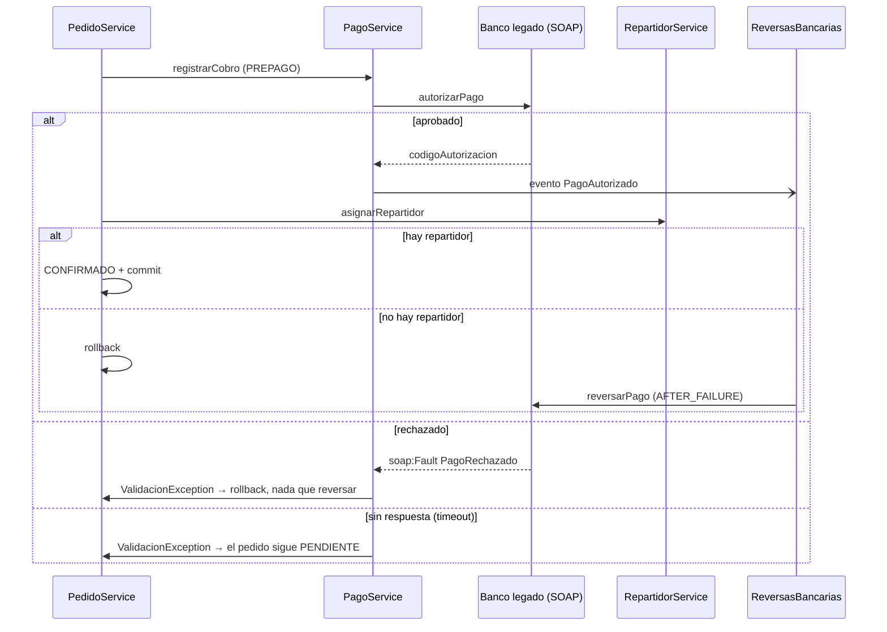

# Mensajería sincrónica

Se usa cuando **el proceso no puede seguir sin la respuesta**. El costo
es el acoplamiento temporal: si el otro lado no contesta, hay que decidir
explícitamente qué hacer.

## SOAP: cobro de pedidos PREPAGO en el banco legado (implementado)

**En una frase:** para confirmar un pedido prepago, Rabbit le pide al
banco que autorice el pago; si después algo falla en Rabbit, el rollback
deshace lo nuestro pero no lo del banco, así que le pedimos al banco que
devuelva la plata.

**Por qué sincrónico:** sin la respuesta del banco no se puede confirmar
el pedido: hay que saber en el momento si se cobró o no.

**Por qué SOAP:** el banco es un sistema legado con contrato WSDL y
errores de negocio tipados (`soap:Fault`).

| Clase | Rol |
|---|---|
| `BancoLegadoService` | Contrato (SEI): `autorizarPago`, `reversarPago` |
| `BancoLegadoServiceImpl` | Banco simulado, publicado en el mismo WAR |
| `PagoRechazadoException` + `PagoRechazadoFaultInfo` | Fault de negocio con el motivo del rechazo |
| `IBancoClient` | Lo único que conoce `PagoService` |
| `BancoClient` | Adapter: cliente JAX-WS (proxy dinámico con `Service.getPort`, sin wsimport), timeout de 5 s |
| `ReversasBancarias` | Pide las reversas (compensación y devoluciones) |

Endpoint: `http://localhost:8080/Rabbit/BancoLegadoService` (WSDL en
`?wsdl`). Aunque está en el mismo servidor, se consume siempre por
SOAP/HTTP. Se puede apuntar a otro banco con la system property
`rabbit.banco.wsdl`.

Regla del banco simulado: un pago de más de **$500.000** se rechaza
(supera el límite); cualquier otro se autoriza con un código `AUT-n`.

### Qué pasa en cada caso

| Caso | Resultado |
|---|---|
| El banco aprueba y todo sale bien | Pedido CONFIRMADO, cobro ACREDITADO con el código del banco |
| El banco rechaza (`soap:Fault`) | El pedido sigue PENDIENTE; el usuario ve el motivo del banco |
| El banco no responde (5 s) | El pedido sigue PENDIENTE: sin respuesta no se sabe si cobró |
| El banco aprueba pero después falla Rabbit (no hay repartidor) | Rollback en Rabbit **y reversa en el banco** (transacción compensatoria) |
| Un administrador cancela un pedido PREPAGO confirmado | Cobro ANULADO y, cuando la cancelación queda confirmada, reversa en el banco |

### Por qué hace falta la reversa

Un rollback de JTA solo deshace lo que Rabbit escribió en su base. El
banco es otro sistema: lo que cobró sigue cobrado. La única forma de
deshacerlo es pedirle la operación inversa. `ReversasBancarias` lo hace
con observers transaccionales, el mismo mecanismo que los publicadores
JMS pero reaccionando al fracaso:

- `PagoAutorizado` + `AFTER_FAILURE`: la transacción que cobró se deshizo.
- `CobroAnulado` + `AFTER_SUCCESS`: la cancelación ya quedó confirmada.

### Limitaciones conocidas

- Si el banco cobró pero la respuesta se perdió por timeout, ese cobro
  queda huérfano en el banco. Lo resolvería una clave de idempotencia y
  una consulta de estado antes de reintentar.
- Si el banco no responde a una reversa, se loguea para devolverla a mano
  (lo resolvería un reintento programado).
- El banco simulado guarda sus movimientos en memoria: se pierden al
  redesplegar.
- La primera descarga del WSDL (`Service.create`) no tiene timeout propio.

## REST: entrada de pedidos del ERP (planificado, Entrega 2)

- `POST /api/pedidos-externos` (JAX-RS), body JSON con comercio, origen,
  líneas, importe y medio de pago.
- **Por qué sincrónico:** el ERP necesita saber en el momento si Rabbit
  aceptó el pedido (validación de datos) y con qué ID. La **conversión**
  en pedido real sigue siendo asincrónica (cola), así que la respuesta es
  inmediata: `201 Created` con el ID del pedido externo.
- **Por qué REST y no SOAP:** el ERP es un partner moderno; JSON sobre
  HTTP no le exige generar clientes a partir de un WSDL.
- Reemplaza al formulario JSF que hoy simula el ERP, así queda una
  frontera real entre sistemas.
