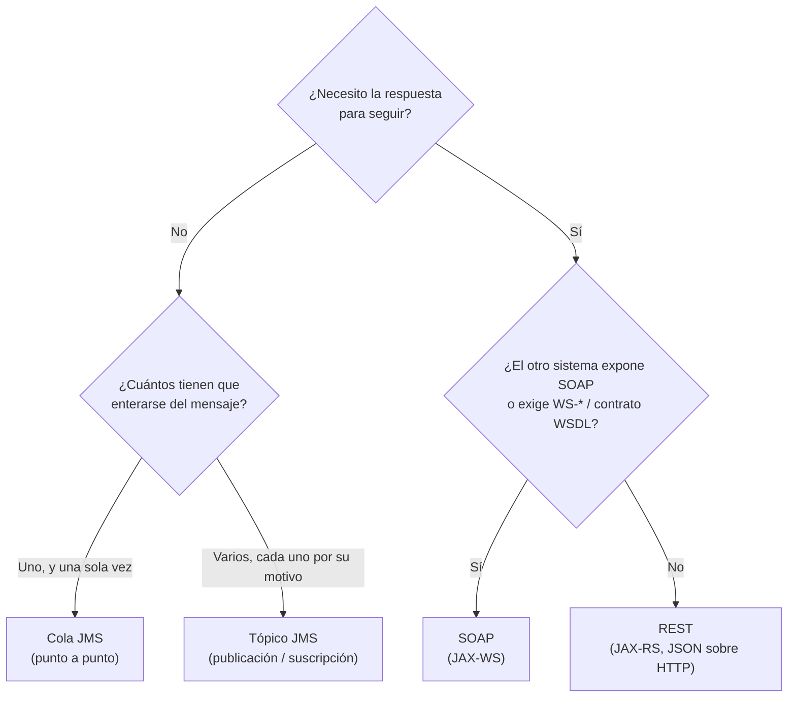
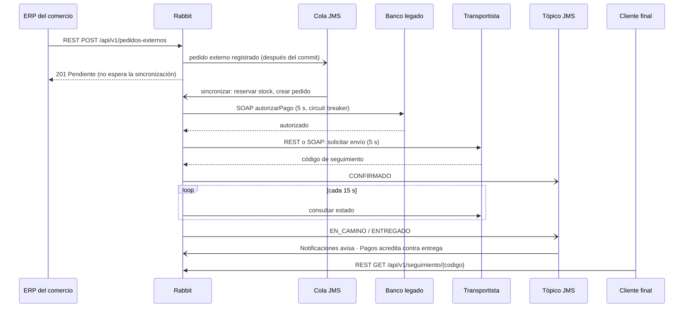

# Mensajería en Rabbit: qué se usa en cada integración y por qué

Rabbit se integra con siete sistemas o consumidores distintos, y no todos
con la misma tecnología. Este documento justifica **cada elección** con un
mismo criterio de decisión, para que se vea que la tecnología sale del
problema y no al revés.

El detalle técnico de cada integración (clases, diagramas, casos de
falla) sigue en [MENSAJERIA-ASINCRONICA.md](MENSAJERIA-ASINCRONICA.md) y
[MENSAJERIA-SINCRONICA.md](MENSAJERIA-SINCRONICA.md). Acá está el
**porqué**.

## 1. El criterio de decisión

Para cada integración se hacen, en orden, estas preguntas:

### Pregunta 1: ¿necesito la respuesta para seguir?

Es la pregunta que separa **sincrónico** de **asincrónico**.

- **No la necesito → mensajería asincrónica (JMS).** El que envía deja el
  mensaje y sigue. Si el otro lado está caído o lento, el mensaje espera
  en el broker: no hay timeout que bloquee a nadie, y la caída de uno no
  se contagia al otro (desacople temporal). Lo que se paga: el resultado
  llega después, así que el resto del sistema tiene que tolerar ese
  "todavía no".
- **La necesito → mensajería sincrónica (SOAP o REST).** El proceso no
  puede decidir nada sin la respuesta (por ejemplo, confirmar un pedido
  sin saber si el banco cobró). Lo que se paga: si el otro sistema no
  contesta, mi proceso queda esperando. Por eso **toda llamada sincrónica
  de Rabbit tiene timeout de 5 s** y una decisión explícita de qué hacer
  si vence.

### Pregunta 1b (asincrónico): ¿cola o tópico?

- **Cola:** un mensaje lo procesa **un solo consumidor**. Sirve cuando el
  trabajo se tiene que hacer exactamente una vez, aunque haya varios
  consumidores compitiendo para repartirse la carga.
- **Tópico:** el mismo mensaje le llega a **todos los suscriptores**. Sirve
  cuando un hecho le interesa a varios componentes por motivos distintos,
  y el que lo publica no tiene por qué conocerlos.

### Pregunta 2 (sincrónico): ¿SOAP o REST?

Cuando **Rabbit consume** un servicio, la tecnología **la impone el otro
sistema**: Rabbit se adapta a lo que el otro expone.

- **Expone SOAP o exige WS-\* (contrato WSDL formal, faults tipados,
  WS-Security, etc.) → SOAP.** Es lo típico de sistemas legados: bancos,
  organismos, empresas con sistemas viejos. No hay opción: si el banco
  solo habla SOAP, se le habla SOAP.
- **No expone SOAP ni exige WS-\* → REST.** Es lo típico de sistemas
  modernos: JSON sobre HTTP, más liviano, sin generar clientes desde un
  WSDL.

Cuando **Rabbit expone** un servicio, la tecnología la elige Rabbit
pensando en quién lo va a consumir: si el consumidor es moderno (el ERP de
un comercio, la web de un comercio, el celular de un cliente), REST; SOAP
solo se justificaría si el consumidor exigiera un contrato WSDL o WS-\*.

## 2. Inventario: todas las integraciones de Rabbit

| # | Integración | Dirección | ¿Necesita la respuesta para seguir? | ¿Expone/exige SOAP? | Tecnología |
|---|---|---|---|---|---|
| 1 | Sincronizar el pedido que llegó del ERP | Interna (Pedidos → Pedidos) | **No** | — | **Cola JMS** `cola.pedidos.externos` |
| 2 | Avisar los cambios de estado del pedido | Interna (Pedidos → Notificaciones, Pagos) | **No** | — | **Tópico JMS** `topico.pedidos.estado` |
| 3 | Cobrar y reversar pagos en el banco | Saliente (Rabbit → banco legado) | **Sí** | **Sí** (WSDL, faults) | **SOAP** |
| 4 | Pedir, seguir y cancelar envíos en un transportista legado | Saliente (Rabbit → transportista) | **Sí** | **Sí** (WSDL, faults) | **SOAP** |
| 5 | Pedir, seguir y cancelar envíos en un transportista moderno | Saliente (Rabbit → transportista) | **Sí** | **No** | **REST** |
| 6 | Recibir pedidos del ERP de cada comercio | Entrante (ERP → Rabbit) | **Sí** (el ERP necesita saber si se aceptó) | **No** (partner moderno) | **REST** (y adentro, cola) |
| 7 | Seguimiento público del pedido | Entrante (cliente → Rabbit) | **Sí** (quiere ver el estado ya) | **No** | **REST** |

Un mismo pedido, de punta a punta, pasa por las tres tecnologías (ver la
sección 4): **no se elige una sola mensajería para todo el sistema; se
elige la correcta para cada integración.**

## 3. Cada integración, justificada

### 3.1 Cola JMS: sincronizar el pedido que llegó del ERP

**Qué pasa:** cuando el ERP registra un pedido, hay que convertirlo en un
pedido real de Rabbit: validar que el comercio esté activo, reservar y
confirmar el stock de cada línea (o validar el punto de picking), crear el
pedido y marcar la fila del ERP como procesada.

**Pregunta 1 — ¿necesito la respuesta para seguir? No.** El ERP solo
necesita saber que Rabbit **recibió** el pedido con datos válidos; no
tiene por qué esperar a que se reserve el stock. Si lo hiciera esperar,
una base lenta o un pico de pedidos frenaría al ERP del comercio.

**Pregunta 1b — ¿cola o tópico? Cola.** Cada pedido se tiene que
sincronizar **exactamente una vez**: si dos consumidores recibieran el
mismo mensaje, el stock se reservaría dos veces. En una cola, varias
instancias de `PedidoExternoListener` compiten y cada mensaje lo procesa
una sola (consumidores competidores, ADR-014). Así además se escala: con
4 consumidores la cola procesa 3,8 veces más rápido que con uno (medido,
ver [DESAFIOS-OPCIONALES.md](DESAFIOS-OPCIONALES.md)).

**Por qué no un tópico:** todos los suscriptores recibirían el mismo
pedido y lo procesarían cada uno: reservas duplicadas.

**Por qué no sincrónico:** el alta del ERP quedaría atada a la
disponibilidad y velocidad de la reserva de stock.

**Cómo se cubre lo que la cola no garantiza:**

| Riesgo | Solución |
|---|---|
| El broker falla justo al publicar | El pedido ya está guardado; el polling de respaldo (`SincronizadorDePedidos`, cada minuto) lo levanta (ADR-001) |
| El mensaje sale pero el pedido no se guardó | El mensaje se publica recién **después del commit** (`AFTER_SUCCESS`), nunca antes (ADR-002) |
| La cola y el polling procesan el mismo pedido a la vez | Bloqueo `PESSIMISTIC_WRITE` + flag `sincronizado`: el segundo lo ignora |
| El consumidor está caído | El mensaje espera en la cola |
| Falla de negocio (sin stock, comercio de baja) | Se descarta con motivo; reintentar no lo arregla |
| Falla transitoria (base caída) | Se relanza la excepción y el broker reintenta la entrega |

### 3.2 Tópico JMS: avisar los cambios de estado del pedido

**Qué pasa:** cada vez que un pedido cambia de estado (`CONFIRMADO`,
`EN_CAMINO`, `ENTREGADO`, `CANCELADO`…), hay componentes que tienen que
reaccionar:

- **Notificaciones** avisa al comercio ("tu pedido está en camino").
- **Pagos** acredita el cobro cuando un pedido `CONTRA_ENTREGA` llega a
  `ENTREGADO` (el repartidor cobró al entregar).

**Pregunta 1 — ¿necesito la respuesta para seguir? No.** El repartidor
que marca "entregado" no tiene por qué esperar a que se mande la
notificación o se acredite el cobro. Si Notificaciones estuviera caído,
el pedido igual tiene que quedar entregado.

**Pregunta 1b — ¿cola o tópico? Tópico.** El mismo hecho ("el pedido 42
pasó a ENTREGADO") lo necesitan **dos** consumidores, cada uno por su
motivo. Con una cola solo lo recibiría uno de los dos. Además, Pedidos
publica el hecho sin conocer a los suscriptores: sumar un tercero (por
ejemplo, facturación) no requiere tocar Pedidos.

**Por qué no llamar directo a Notificaciones y a Pagos:** Pedidos
dependería de los dos, y la caída de cualquiera frenaría el cambio de
estado.

**Cómo se cubre lo que el tópico no garantiza:**

| Riesgo | Solución |
|---|---|
| Un suscriptor no está activo cuando se publica (por ejemplo, durante un redeploy) | **Suscripciones durables**: el broker le guarda el mensaje y se lo entrega al volver (ADR-009). Probado deteniendo el MDB de Pagos |
| A Pagos solo le importa `ENTREGADO` | **Selector** `estado = 'ENTREGADO'`: el broker ni siquiera le entrega los demás |
| El mismo evento llega dos veces | Pagos es idempotente (si ya está `ACREDITADO`, no hace nada); Notificaciones descarta repetidos por `fechaCambio` |
| Los eventos llegan desordenados | Notificaciones ignora los más viejos que el último que vio; a Pagos no le afecta (`ENTREGADO` es final) |

### 3.3 SOAP: cobrar y reversar pagos en el banco legado

**Qué pasa:** para confirmar un pedido `PREPAGO`, Rabbit le pide al banco
que autorice el pago. Si después algo falla en Rabbit (por ejemplo, no hay
repartidor), le pide al banco que reverse el cobro.

**Pregunta 1 — ¿necesito la respuesta para seguir? Sí.** No se puede
confirmar un pedido prepago sin saber si el banco cobró. Con mensajería
asincrónica el pedido quedaría confirmado "a ciegas" y habría que
deshacerlo si después el banco rechaza.

**Pregunta 2 — ¿el banco expone SOAP o exige WS-\*? Sí.** El banco es un
sistema legado: publica un **contrato WSDL** (`autorizarPago`,
`reversarPago`) y comunica los rechazos de negocio con un **fault
tipado** (`PagoRechazado`, con el motivo). Rabbit no elige: si el banco
habla SOAP, se le habla SOAP. Ese contrato formal además es una ventaja
para dinero: el tipo de cada campo y cada error posible están definidos.

**Por qué no REST:** el banco no lo ofrece. **Por qué no una cola:**
Rabbit necesita la respuesta en el momento.

**Que sea SOAP no depende del lenguaje del banco:** el mismo banco está
implementado también en Node.js (`banco-legado/`) detrás del **mismo
WSDL**, y Rabbit lo consume sin cambiar una línea (ADR-015). Lo que
define la tecnología es el contrato que expone el otro sistema.

**Cómo se maneja que el banco no conteste (el costo de lo sincrónico):**

| Situación | Qué hace Rabbit |
|---|---|
| El banco no responde en **5 s** | El pedido sigue `PENDIENTE` (sin respuesta no se sabe si cobró); el usuario puede reintentar |
| El banco falló 3 veces seguidas | **Circuit breaker** abierto: las llamadas se cortan al instante, sin esperar 5 s cada una, para que la caída del banco no agote los hilos de Rabbit (ADR-011). A los 30 s prueba de nuevo |
| El banco rechaza (`soap:Fault`) | Es una respuesta válida: el pedido sigue `PENDIENTE` con el motivo del banco |
| El banco cobró pero Rabbit falla después | El rollback deshace lo de Rabbit, pero no lo del banco: **transacción compensatoria** (`reversarPago`, ADR-010) |

### 3.4 SOAP: transportista legado

**Qué pasa:** cuando un pedido no lo lleva un repartidor propio, se
deriva a una empresa de envíos. Rabbit le pide el envío, le consulta el
estado periódicamente y, si se cancela el pedido, le anula el envío.

**Pregunta 1 — ¿necesito la respuesta para seguir? Sí.** Para confirmar
el pedido derivado, Rabbit necesita saber en el momento si el
transportista **tomó** el envío y con qué **código de seguimiento**. Si lo
rechaza (por ejemplo, más de 50 bultos), el pedido no se confirma.

**Pregunta 2 — ¿expone SOAP o exige WS-\*? Sí.** Este transportista
tiene un sistema legado con WSDL (`registrarEnvio`, `consultarEnvio`,
`anularEnvio`) y un fault `EnvioRechazado`. Rabbit se adapta: SOAP.

### 3.5 REST: transportista moderno

**Mismo problema que el anterior y misma respuesta a la pregunta 1** (Sí,
necesito saber si tomó el envío). Cambia la pregunta 2:

**Pregunta 2 — ¿expone SOAP o exige WS-\*? No.** Este transportista
publica una API REST con JSON: `POST /envios` (201 tomado, 422
rechazado), `GET /envios/{codigo}`, `DELETE /envios/{codigo}`. Rabbit lo
consume con el cliente estándar de Jakarta REST.

**Los dos transportistas muestran el criterio en acción:** el **mismo
problema de negocio** se resuelve con **dos tecnologías distintas**,
porque la tecnología la impone cada transportista. Para que eso no
contamine la lógica de negocio, cada uno tiene su **Adapter**
(`AdaptadorSoapTransportista`, `AdaptadorRestTransportista`) detrás de
una interfaz común (`IAdaptadorTransportista`): Pedidos no sabe si del
otro lado hay SOAP o REST (ADR-016).

**¿Y el seguimiento posterior, por qué no asincrónico?** Lo ideal sería
que el transportista **avisara** cada cambio (un webhook, que en el fondo
es mensajería sobre HTTP). Pero un transportista legado no avisa: solo
responde si se le pregunta. Por eso el seguimiento es por **polling**:
`SeguimientoDeEnvios` consulta cada 15 s, en segundo plano. Las consultas
son sincrónicas, pero **nadie espera** por ellas (no hay un usuario
bloqueado), así que una demora o caída del transportista no frena a
Rabbit. Para los transportistas modernos, un webhook queda como mejora.

| Situación | Qué hace Rabbit |
|---|---|
| El transportista no responde en **5 s** al pedir el envío | El pedido sigue `PENDIENTE`: "probá de nuevo o con otro transportista" |
| Lo rechaza (fault `EnvioRechazado` o `422`) | El pedido sigue `PENDIENTE` con el motivo; si ya se había cobrado, se reversa en el banco |
| No responde a una consulta de seguimiento | Se reintenta en la próxima pasada (15 s) |
| Se cancela el pedido | El envío se anula en el transportista **después** del commit (compensación) |

### 3.6 REST: recibir pedidos del ERP de cada comercio

**Qué pasa:** el sistema de cada comercio (su ERP) le manda a Rabbit los
pedidos que vendió, consulta cómo terminaron y los puede cancelar.

**Pregunta 1 — ¿necesito la respuesta para seguir? Sí, pero solo una
parte.** El ERP necesita saber **en el momento** si Rabbit aceptó el
pedido (datos válidos) y con qué identificador, para poder seguirlo. Lo
que **no** necesita esperar es la conversión en pedido real (3.1). Por
eso esta integración **combina las dos mensajerías**:

1. La recepción es **sincrónica**: el ERP recibe enseguida un `201
   Created` con el pedido externo en estado `Pendiente`, o un error que le
   dice qué corregir.
2. La conversión es **asincrónica**: el pedido entra a la cola (3.1).
3. El ERP consulta después cómo terminó (`GET`), o sigue los `_links` de
   la respuesta.

**Pregunta 2 — acá Rabbit expone, así que elige pensando en el
consumidor.** El ERP de un comercio es un **partner moderno**: no exige
WSDL ni WS-\*, y JSON sobre HTTP no lo obliga a generar clientes desde un
contrato SOAP. Por lo tanto: **REST**. SOAP solo se justificaría si el
ERP exigiera un contrato WSDL o seguridad a nivel mensaje (WS-Security).

**¿Por qué 201 y no 202 Accepted?** `202` significa "recibí el pedido,
todavía no creé nada". Acá el recurso (el pedido externo) **sí** se crea
en el momento y tiene su URI (`Location`); lo que queda pendiente es su
procesamiento, que se refleja en el campo `resultado`. Por eso `201`.

**Lo que REST obliga a resolver a mano** (en SOAP venía con WS-\*):

| Tema | Cómo se resolvió |
|---|---|
| El ERP reintenta tras un timeout y duplica el pedido | `Idempotency-Key` obligatoria: la misma clave devuelve el mismo pedido (ADR-018) |
| Errores tipados (el `soap:Fault` de SOAP) | **Problem Details** (RFC 9457): `type`, `title`, `status`, `detail` |
| Contrato formal (el WSDL de SOAP) | **OpenAPI** en [openapi.yaml](openapi.yaml) |
| Seguridad (WS-Security en SOAP) | HTTP Basic + rol `ERP` atado a un comercio; en producción, sobre TLS |
| Cambios que rompen a los clientes | Versión en la URI (`/api/v1`) |

**Y la pregunta de la cátedra: "si el SOAP legado no responde en 5 s,
¿qué devuelve la API?"** Esta API **no llama al banco** en forma
sincrónica: responde `201 Pendiente` al instante. El cobro SOAP ocurre
después, al confirmar el pedido, con su timeout y su circuit breaker
(3.3). Si el banco no contesta, el pedido sigue `PENDIENTE` y el ERP lo
ve con `GET` (`estadoPedido`). Que la recepción no dependa del banco es
justamente lo que se gana poniendo la cola en el medio.

### 3.7 REST: seguimiento público del pedido

**Qué pasa:** el cliente final (o la web del comercio) consulta el estado
de un pedido con su código de seguimiento, sin loguearse:
`GET /api/v1/seguimiento/{codigo}`.

**Pregunta 1 — ¿necesito la respuesta para seguir? Sí:** quien consulta
quiere ver el estado ahora. Es una lectura: no hay nada que encolar.

**Pregunta 2 — Rabbit expone; el consumidor es un navegador o un
celular.** Lo natural es **REST**: se consume con un `fetch` o con el
navegador, sin herramientas especiales. SOAP sería absurdo para un
cliente final. Además, al ser un `GET`, la respuesta podría cachearse con
la caché HTTP estándar, algo que SOAP no aprovecha.

## 4. Las tres tecnologías en un mismo pedido

| Tramo | Sincrónico o asincrónico | Tecnología | Por qué |
|---|---|---|---|
| ERP → Rabbit (alta) | Sincrónico | REST | El ERP necesita saber si se aceptó; es un partner moderno |
| Alta → pedido real | Asincrónico | Cola | Nadie tiene que esperar la reserva; se procesa una sola vez |
| Rabbit → banco | Sincrónico | SOAP | Sin saber si cobró no se confirma; el banco es legado con WSDL |
| Rabbit → transportista | Sincrónico | REST o SOAP | Hay que saber si tomó el envío; la tecnología la impone cada transportista |
| Cambio de estado → interesados | Asincrónico | Tópico | Varios interesados; nadie tiene que esperarlos |
| Cliente → Rabbit (seguimiento) | Sincrónico | REST | Lectura inmediata desde un navegador |

## 5. Lo que no es mensajería entre sistemas: eventos CDI

Dentro de Rabbit también hay avisos entre clases (`PedidoExternoRegistrado`,
`EstadoPedidoCambiado`, `PagoAutorizado`, `EstadoEnvioCambiado`, etc.).
Son **eventos CDI**, no JMS, porque ocurren dentro del mismo proceso y
sirven para algo distinto: **engancharse a la transacción**.

- El publicador de la cola y el del tópico observan el evento con
  `AFTER_SUCCESS`: el mensaje JMS sale **solo si el commit se hizo**
  (ADR-002).
- `ReversasBancarias` observa `PagoAutorizado` con `AFTER_FAILURE`: si la
  transacción que cobró se deshizo, pide la reversa al banco.

JMS no daría esto: un mensaje no sabe si la transacción que lo originó
terminó bien o mal. Por eso el patrón es **evento CDI para el "cuándo"
(después del commit) y JMS para el "a quién" (otros componentes, aunque
estén caídos)**.

## 6. Resumen: por qué no la otra opción

| Integración | Elegida | Descartada | Por qué no |
|---|---|---|---|
| Sincronizar pedido | Cola | Tópico | Varios lo procesarían: stock reservado dos veces |
| Sincronizar pedido | Cola | Llamada sincrónica | El ERP quedaría esperando la reserva de stock |
| Estados del pedido | Tópico | Cola | Solo un interesado recibiría el aviso |
| Estados del pedido | Tópico | Llamada directa | Pedidos dependería de Notificaciones y Pagos, y su caída lo frenaría |
| Banco | SOAP | REST | El banco no lo ofrece: expone WSDL y faults |
| Banco | SOAP | Cola | Hace falta saber en el momento si cobró |
| Transportista legado | SOAP | REST | No lo ofrece |
| Transportista moderno | REST | SOAP | No expone WSDL; REST es lo que publica |
| Seguimiento de envíos | Polling | Webhook (aviso) | Un transportista legado no avisa; queda como mejora para los modernos |
| ERP → Rabbit | REST + cola | SOAP | El ERP es moderno y no exige WSDL ni WS-\* |
| ERP → Rabbit | REST + cola | Solo cola (que el ERP publique en el broker) | Expondría el broker interno a un sistema externo, y el ERP no sabría en el momento si el pedido es válido |
| Seguimiento público | REST | SOAP | El consumidor es un navegador o un celular |

**En una frase:** si no hace falta la respuesta, se encola (cola si lo
procesa uno, tópico si les interesa a varios); si hace falta, se llama: con
SOAP cuando el otro sistema lo impone, con REST en todos los demás casos.
